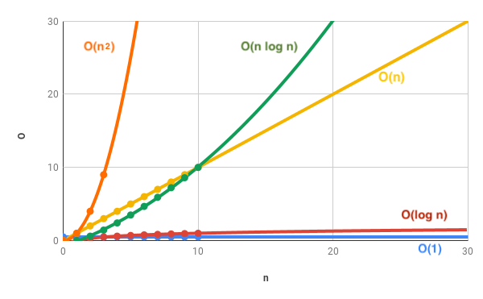

# 各排序算法的时间复杂度

## 时间复杂度数值比较图

好文推荐，[JS 里的简易算法和数据结构之复杂度](https://www.freecodecamp.org/chinese/news/the-complexity-of-simple-algorithms-and-data-structures-in-javascript/)

## 总览

|排序算法|最好时间复杂度|最坏时间复杂度|平均时间复杂度|
|---|---|---|---|
|冒泡排序|O(n)|O(n²)|O(n²)|
|选择排序|O(n²)|O(n²)|O(n²)|
|插入排序|O(n)|O(n²)|O(n²)|
|快速排序|O(nlogn)|O(n²)|O(nlogn)|
|堆排序|O(nlogn)|O(nlogn)|O(nlogn)|
|希尔排序|O(nlog²n)|O(nlogn)|O(nlogn)|
