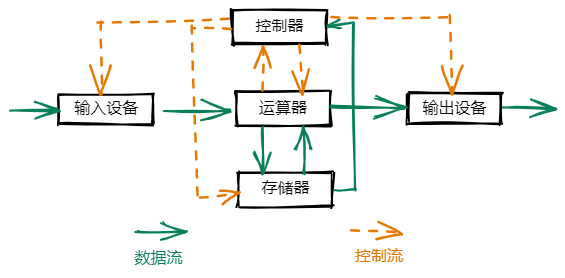
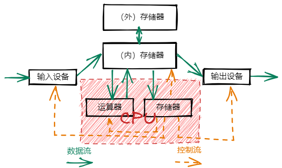

# 冯诺依曼计算机

## 特点

1. 计算机由五大部件组成
2. 指令和数据以同等地位存于存储器，可按地址寻访
3. 指令和数据用二进制表示
4. 指令由操作码和地址码组成
5. 存储程序
6. 以运算器为中心

通过内部存储器安放存储程序，成功解决了当时计算机存储容量太小，运算速度过慢点问题。

## 五大部件

**缺点**：

以运算器为中心，输入设备和输出设备都需要通过运算器才能访问存储器，运算器承担了过多的工作。

### 运算器

负责算数运算（加减乘除） 和 逻辑运算（与或非）

### 存储器

存放程序和数据

### 控制器

指挥程序运行

### 输入设备

将现实世界的信息转换成计算机能识别的二进制形式

### 输出设备

将二进制结果转换成人们熟悉的形式

## 现代计算机

在冯诺依曼计算机的基础上改进，将运算器和控制器整合到一起形成**CPU（中央处理器）**

以**存储器**为中心

