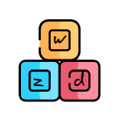

  wendzzoo

  wendzzoo's blogs

# I'm wendzzoo 👋
关于平常工作学习中在前端方向的学习总结记录。

## 社交主页

|[github](https://github.com/Zuowendong)|[掘金](https://juejin.cn/user/342703359942776)|[segmentfault](https://segmentfault.com/u/zuowendong)|[csdn](https://blog.csdn.net/bertZuo)
|--|--|--|--|
