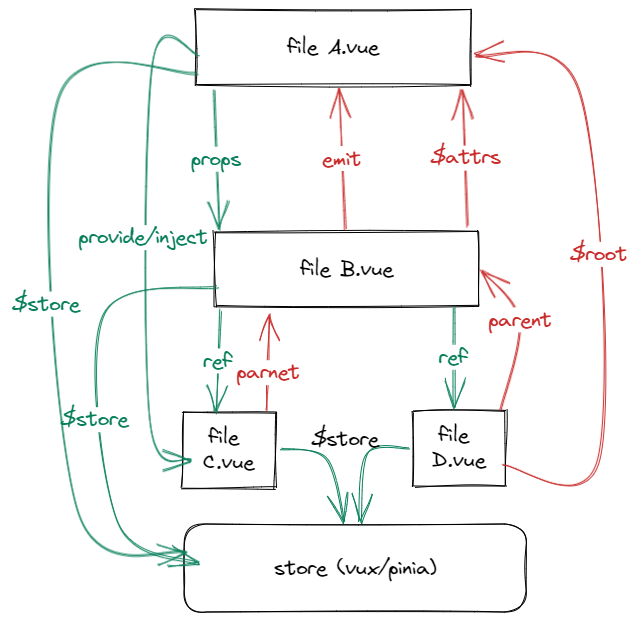
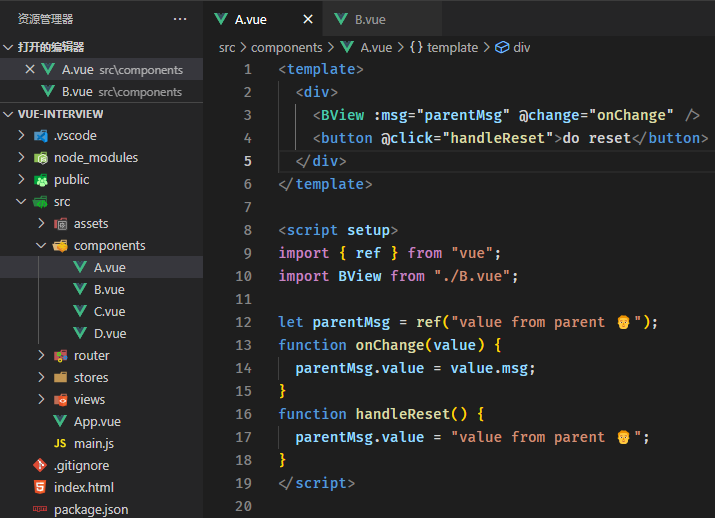
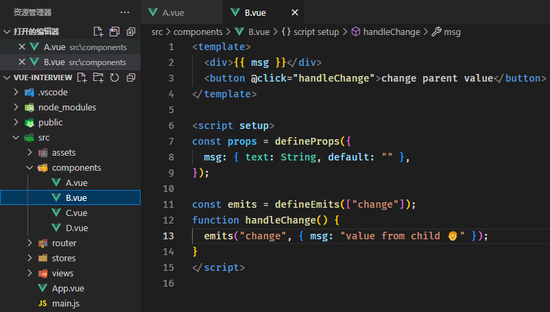
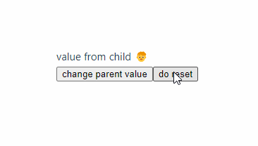
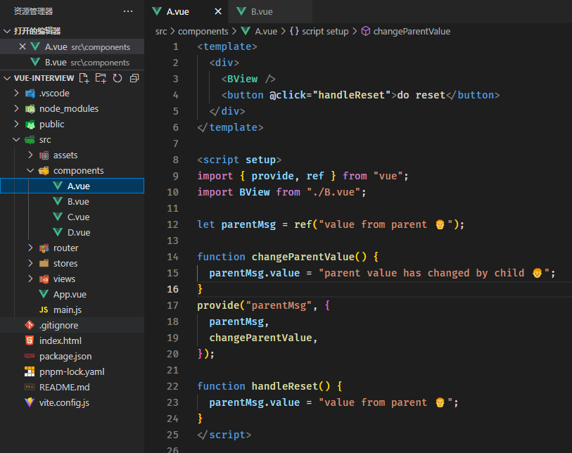
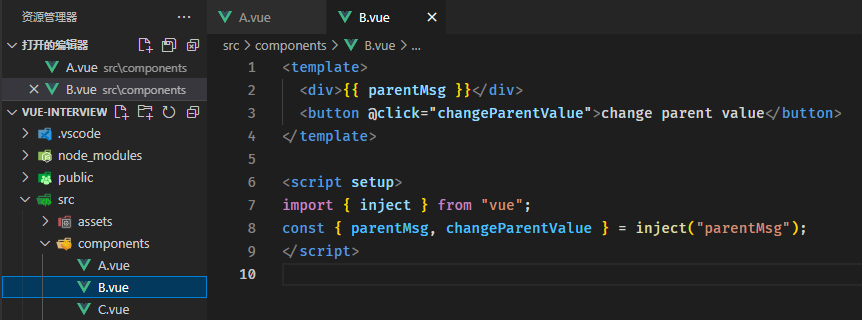
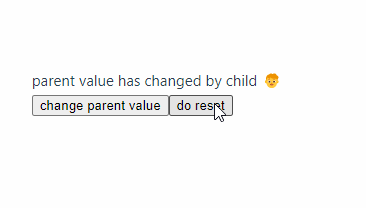

# 组件间通信方式

有以下8种

* props
* $emit/$on
* $children/$parent
* $attrs/$listeners
* ref
* $root
* eventBus
* store

## 按照组件间关系阐述使用场景

## 父子间通信

props/emit, parent/children(vue2), ref, provide/inject, attrs/listeners(vue2)

**props/emit**

**provide/inject**

1. 在父组件中使用provide函数为子代组件提供数据，provide函数接收两个参数，一个是注入名（字符串类型和symbol类型），方便后代组件找到它，另一个是需要传的值（任意类型）
2. 子组件中使用inject函数接收来自父组件的传值，inject函数接收两个参数，一个provide中定义的注入名，另一个是默认值
3. 子组件修改来自父组件的数据，修改方法仍然在父组件中定义，通过provide传输

$children

vue3中移除，可以使用模板引入，声明一个同名ref就能获取子组件。

$attrs

不会用

## 兄弟间通信

eventBus(vue2， vue3中推荐使用mitt插件), store
eventBus
vue3中移除了$on、$off 和 $once 这些事件api，这导致了eventBus在vue3中实现不是那么简单，需要借助第三方库去实现，比如官方推荐的mitt
官方也是不鼓励使用eventBus在组件间通信，从长期角度看维护成本太高，有很多更好的方案替代eventBus

## 跨级通信

provide/inject, attrs/listeners(vue2), eventBus, store

## 没有关系的通信

store
