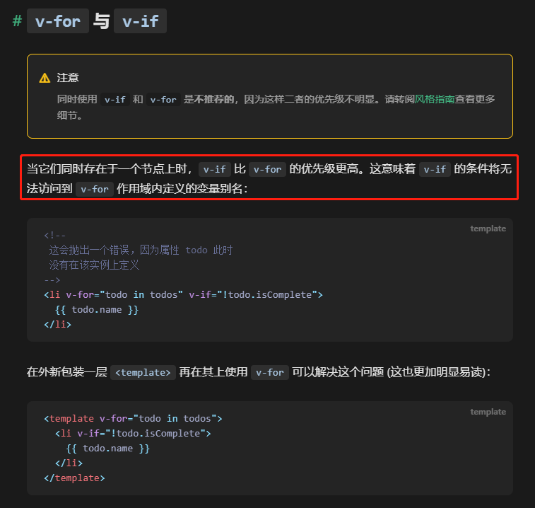
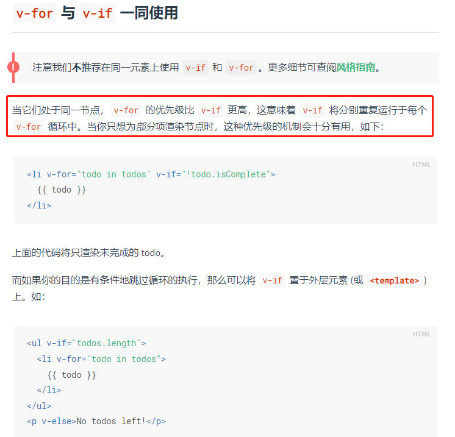
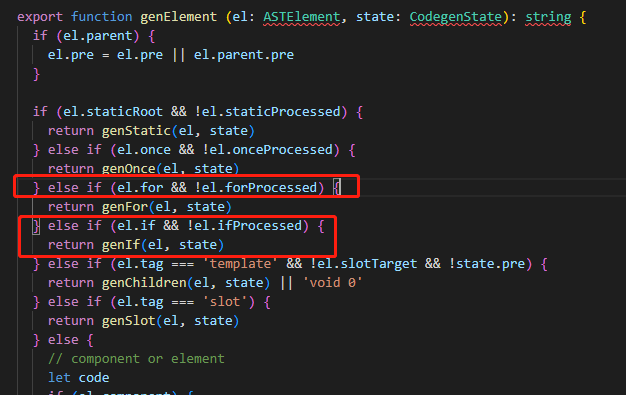

# v-if 和 v-for 优先级

## 回答思路

1. 给出结论
2. 为什么是这样的，说出细节
3. 哪些场景可能导致我们要这么做，该如何处理
4. 总结

> 在vue2中v-for的优先级高于v-if，在vue3中v-if的优先级高于v-for

**官方文档**

Vue3官方文档

Vue2官方文档

这是在两个版本的官方文档中特别注意事项中标明的内容，而且v-for 和  v-if 是不能放在一起使用的。

> vue2中从输出的渲染函数中可以看出是 先执行循环 再判断条件，哪怕是只渲染列表中一部分元素，那也得再每次重新渲染的时候都要遍历整个列表，这样比较浪费。
>
> 在vue3中 v-if的优先级高于v-for，v-if 是无法访问到v-for作用域内定义的变量

> 在实际使用过程中，常有这样的需求导致想要v-for和v-if一起用
> 一个是过滤列表项，另一个就是为了避免渲染要被隐藏的列表，更好的解决方案，第一个是通过计算属性把需要过滤的列表项先计算出来在v-for, 第二个就是v-if 作用于 v-for 的父组件上

从源码中也可以看出

vue2

vue3
