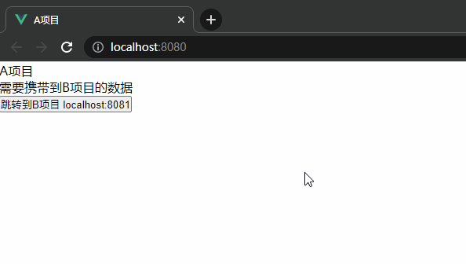

# 本地存储和localStorage的跨域方案

## 相同点

1. 都是H5新特性，用来存储客户端临时信息的对象
2. 都只能存储字符串类型的对象
3. 不同浏览器之间无法共享

## 不同点

**localStorage**:

1. 在同源的所有标签页和窗口之间共享数据
2. 数据不会过期。它在浏览器重启甚至系统重启后仍然存在

**sessionStorage**:

1. sessionStorage 的数据只存在于当前浏览器标签页
   1. 具有相同页面的另一个标签页中将会有不同的存储
   2. 但是，它在同一标签页下的 iframe 之间是共享的（假如它们来自相同的源）
2. 数据在页面刷新后仍然保留，但在关闭/重新打开浏览器标签页后不会被保留

## 跨域情况处理

理论上 localStorage 只在同域名下共享数据，但常存在跨域情况下需要共享数据的业务场

例如一个管理平台的项目，现在需要在首页有个按钮点击跳转到它的大屏展示页面，这个大屏项目是个另起的单独项目，但是后端复用了平台上很多模块的接口，这些接口都需要携带平台那登录之后才能获取的token，平台项目端的token是存储在 localStorage 中，两个项目的域名也不一样，这就出现了需要跨域从平台的 localStorage 中传输数据到大屏项目

### 解决方案 配置nginx

实际项目中这样的业务场景，两个项目隶属于同一个平台下，更合理的实现应该是将两个项目在nginx中配置成一个同源地址

例如：

我部署的个人项目，大屏设计器项目在 <http://106.53.143.75:8080/>， 在线简历模板项目在 <http://106.53.143.75:8080/resume/>

```yam
location / {
   root   /home/zwd/docker/vue/designer;
   index  index.html index.htm;
}

location /resume {
   alias  /home/zwd/docker/vue/resume;
   index  index.html index.htm;
}
```

### 解决方案 使用postMessgae

使用postMessgae, 可以安全地实现跨源通信

MDN文档地址，[戳这里](https://developer.mozilla.org/zh-CN/docs/Web/API/Window/postMessage)

### 示例

vue2 新建一个A项目，vue3新建一个B项目

A项目，App.vue

```html
<template>
 <div id="app">
  <div>A项目</div>
  <div>需要携带到B项目的数据</div>
  <button @click="handleToB">跳转到B项目 localhost:8081</button>
 </div>
</template>

<script>
export default {
 name: "App",
 data() {
  return {};
 },
 mounted() {
  localStorage.setItem("msg", "需要携带到B项目的数据");
 },
 methods: {
  handleToB() {
   let targetUrl = "http://localhost:8081/";
   const windowB = window.open(targetUrl);

   window.addEventListener(
    "message",
    (e) => {
     windowB.postMessage(localStorage.getItem("msg"), targetUrl);
    },
    false
   );
  },
 },
};
</script>
```

B项目，App.vue

```html
<template>
 <div>B项目</div>
 <div>{{ msg }}</div>
</template>

<script setup>
import { ref } from "vue";
let msg = ref("");

const originalUrl = "http://localhost:8080";
window.opener.postMessage("loading finished", originalUrl);
window.addEventListener(
 "message",
 (e) => {
  if (e.origin == originalUrl) {
   msg.value = e.data;
   localStorage.setItem("msg", msg.value);
  }
 },
 false
);
</script>
```

实现效果


