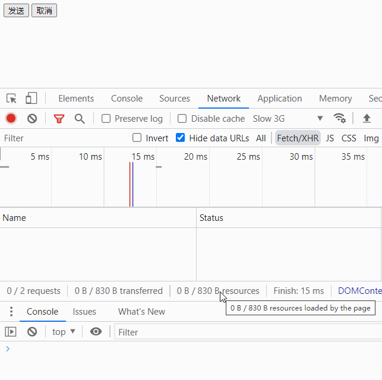
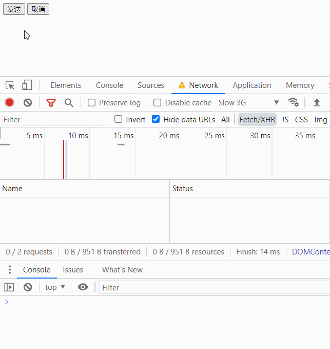
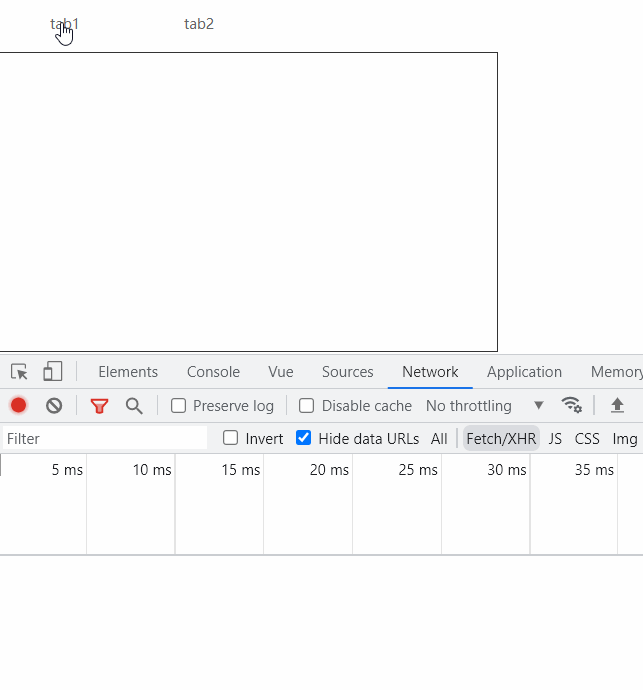

# XMLHttpRequest 和 fetch

## 取消请求

### XMLHttpRequest

index.html

```html
  <button onclick="startFetch()">发送</button>
  <button onclick="abortFetch()">取消</button>
```

```js
const xhr = new XMLHttpRequest();
const url = "https://robohash.org/1";
xhr.open("GET", url, true);
xhr.onreadystatechange = (state) => {
if (xhr.readyState === 4 && xhr.status === 200) {
  console.log(xhr.responseText);
}
};
function startFetch() {
  console.log("start");
  xhr.send();
}
function abortFetch() {
  console.log("abort");
  xhr.abort();
}
```

效果

由于请求速度快会立即响应，在控制台中 NetWork -> No throttling 修改成 Slow 3G

当前的 HTTP 请求的 Status 是 pending 时，点击取消会变成 canceled 的状态

如果请求已经成功响应之后，再点击取消是无效的



### fetch

```js
const controller = new AbortController();
let signal = controller.signal;
signal.addEventListener("abort", () => {
  console.log("aborted");
});

function startFetch() {
  console.log("start");
  let url = "https://robohash.org/1";
  fetch(url, {
    method: "get",
    signal,
  })
    .then((res) => {
      console.log("fetch finished");
    })
    .catch((err) => {
      console.error(err);
    });
}
function abortFetch() {
  console.log("abort");
  controller.abort();
}
```

效果



## 示例

参考文章，[前端取消请求与取消重复请求](https://juejin.cn/post/7108359238598000671#heading-3)

有这样的一个业务场景，tab切换，点击tab调用接口获取数据，点击 A tab 调用接口 `/api/tab1`, 接口返回慢，立即点击 B tab 调用了接口 `/api/tab2`, 数据返回渲染到页面上。

基于express搭建个api服务以供测试，这里tab1接口用setTimeout延迟发送，模拟接口响应缓慢的效果，

```js
import express, { Application, Request, Response } from "express";
const app: Application = express();
const port: number = 8081;

app.get("/tab1", (request: Request, response: Response) => {
  setTimeout(() => {
    response.status(200).send({
      msg: "ok",
      data: "tab1tab1tab1tab1tab1tab1tab1",
    });
  }, 2000);
});
app.get("/tab2", (request: Request, response: Response) => {
  response.status(200).send({
    msg: "ok",
    data: "tab2tab2tab2tab2tab2tab2tab2",
  });
});

app.listen(port, () => {
  console.log(`Example app listening on port ${port}`);
});
```

前端，vite快速搭建一个vue项目

```html
<template>
 <div class="tabContent">
  <div
   v-for="(tab, i) in TABS"
   :key="i"
   :class="['tabItem', { activeItem: currentTab === tab.key }]"
   @click="handleChange(tab)"
  >
   <span>{{ tab.name }}</span>
  </div>
 </div>
 <div class="content">
  {{ content }}
 </div>
</template>

<script setup lang="ts">
import { ref, reactive } from "vue";
import { request } from "@/libs";

interface ITab {
 key: string;
 name: string;
}

let TABS: ITab[] = reactive([
 { key: "a", name: "tab1" },
 { key: "b", name: "tab2" },
]);
let currentTab = ref<string>("");
let content = ref<string>("");
function handleChange(tab: ITab) {
 currentTab.value = tab.key;

 if (tab.key === "a") {
  getTab1Data();
 } else {
  getTab2Data();
 }
}

async function getTab1Data() {
 const res = await request({
  url: "/api/tab1",
 });
 content.value = res as unknown as string;
}
async function getTab2Data() {
 const res = await request({
  url: "/api/tab2",
 });
 content.value = res as unknown as string;
}
</script>
```

效果


