## 1、JS 数据类型有哪些？区别？

JS 的数据类型分为两类，分别是`基本数据类型`和`引用数据类型`。

它们主要区别是在内存中的存储方式不同。

基本数据类型：`number 数字`、`string 字符串`、`boolean 布尔值`、`null 空值`、`undefined 未定义`、`symbol 唯一值`、`BigInt 最大值`。

基本数据类型有固定的大小和值，存放在栈中，可以直接访问，而引用数据类型不确定大小，但是其引用地址是固定的，因此，它的地址存在栈中，指向存储在堆中的对象。

引用数据类型：`Object` (包括普通对象，数组，正则，日期，Math 数学函数等)。引用数据类型是存放在堆中的对象，在栈中保存的是对象在堆中的引用地址(引用变量)，通过引用地址可以快速查找到保存在堆中的对象。

Symbol 是 Es6 新出的一种数据类型，这种数据类型的特点就是没有重复的数据，可以做 object 的 key。

BigInt 也是 ES6 新出的一种数据类型，BigInt 可以表示任意大的整数，能够解决解精度缺失的问题 (超过 Number 类型支持范围的数值都会失去精度)。

使用方法：

1. 整数末尾直接加 n：647326483767797n。
2. 调用 BigInt() 构造函数：BigInt("647326483767797")。

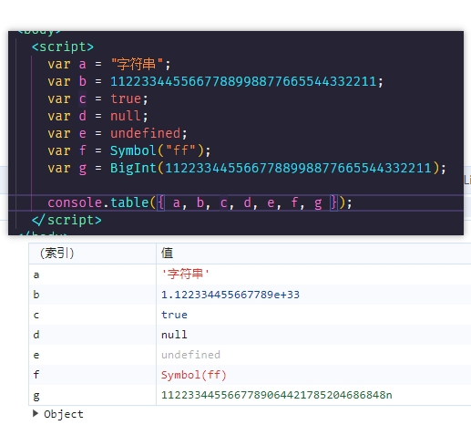

## 2、JS 中检测数据类型的有哪些？

typeof：常用于判断基本数据类型，除了 null 检测为 object。对于引用数据类型除了 function 返回 function，其余全部返回 object。

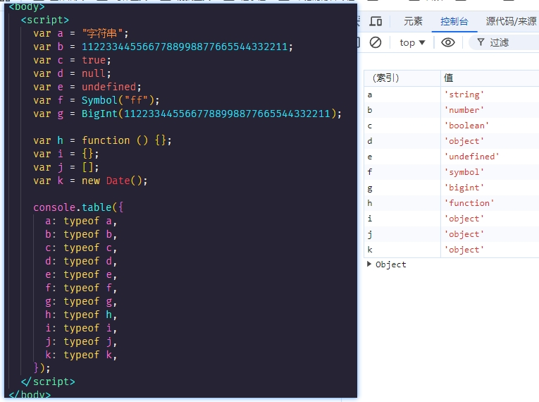

instanceof：主要用于检测引用数据类型，不适合用来检测基本数据类型。如果检测的类型在当前实例的原型链上，则返回 true，说明这个实例属于这个类型，否则返回 false。

例如： A instanceof B，判断 B 在不在 A 的原型链上，如果在就返回 true，如果找到原型链的尽头 null 都没找到，就返回 false。(由于原型链的指向可以随意改动，导致检测不准确)

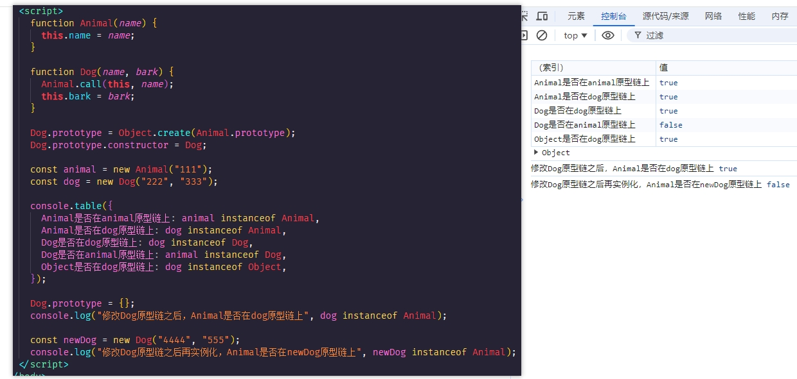

constructor：获取实例的构造函数判断和某个类型是否相同，如果相同就说明该数据是符合那个数据类型的。

使用方法是："实例.constructor"。constructor 可以检测出除了 undefined 和 null 以外的其他类型，因为 undefined 和 null 没有原生构造函数。(不可靠，容易被修改)

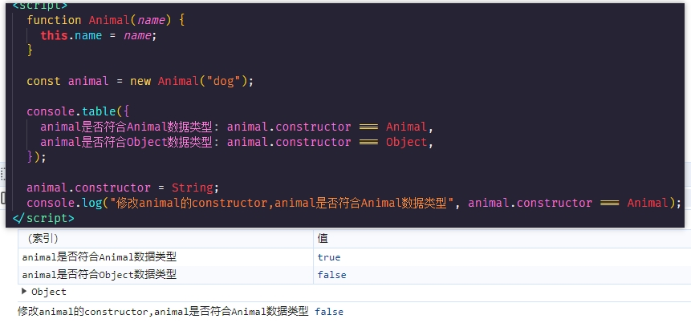

object.prototype.toString.call( )：适用于所有类型的判断检测，检测方法是： - Object.prototype.toString.call(数据) ，返回的是该数据类型的字符串。

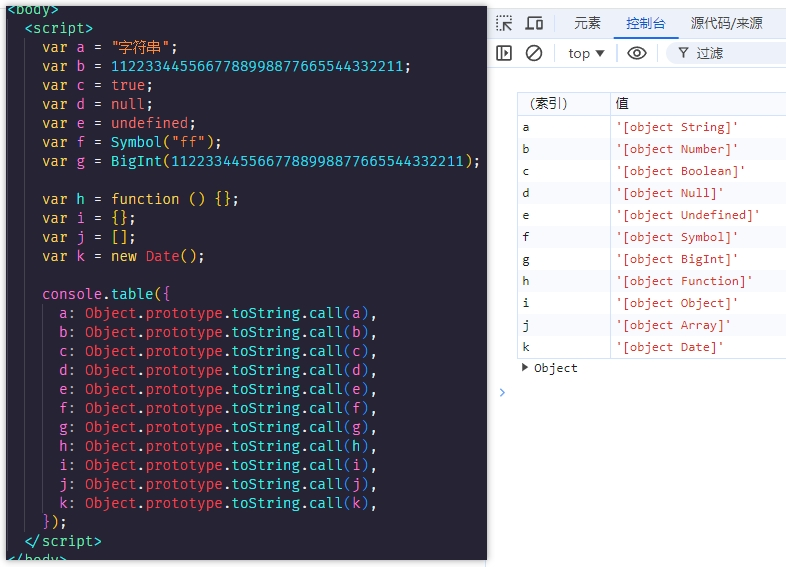

## 3、JS 中的栈和堆是什么？优缺点？

JS 的变量都储存到内存中，内存中开辟了两个区域储存变量，分别是`栈区域`和`堆区域`。

栈与堆实际上是操作系统对进程占用的内存空间的两种管理方式。

**栈：**

栈是一种先进后出的数据结构，由操作系统自动分配内存空间，自动释放，占固定的大小空间。

栈存储的是基本数据类型的值以及引用数据类型的引用地址。

栈中存储的数据的生命周期随着当前环境的执行完成而结束。

**堆：**

堆由操作系统动态分配内存空间，大小不定也不会自动释放，一般由程序员分配释放也可由垃圾回收机制回收。

栈存储的是对象和复杂数据结构，存储的是对象的实际数据，而不是对象的引用。

引用数据类型只有在引用的它的变量不在时，被垃圾回收机制回收。

**栈和堆的优缺点：**

1. 栈相对于堆存取速度更快，且栈内存中数据是可以共享的，但内存空间有限。
2. 堆存取效率相对较低，但内存空间大。
3. 栈内存可以及时得到回收，相对来说更容易管理内存空间，但存储在栈中的数据大小和生存期必须是确定的，缺乏灵活性。
4. 堆的内存是操作系统动态分配的，方便存储和开辟内存空间。有垃圾回收机制，生存周期比较灵活。

## 4、深克隆和浅克隆？

**浅克隆：**

克隆对象的第一层属性。

如果是基本数据类型，直接将存储在栈中的值赋值给对应的变量，原始值改变不会影响。

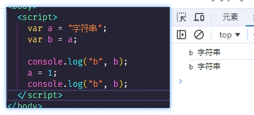

如果是引用数据类型，则克隆的是对象的引用地址，改变引用地址，新对象也会跟着改变，想要改变这种继承的现象就要使用深度克隆。

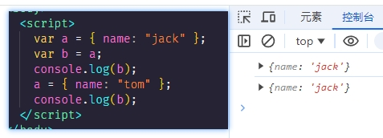

在 JS 中可以通过 Object.assign( ) 或者扩展运算符 ... 合并对象实现浅克隆。

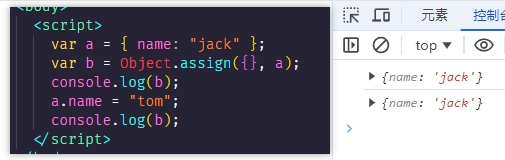

**深克隆：**

克隆对象各个层级的属性。

深克隆是指创建一个与原对象完全相同的新对象 (数据源不同，数据地址已变化)。

可以通过递归的方式实现深克隆，通过递归遍历对象的所有属性，并为每个属性创建新的副本。

对于简单的对象结构，这种方法效率很高，但对于非常深层嵌套的对象，可能会导致栈溢出。

也可以通过简单粗暴的方式实现 JSON.parse (JSON.stringify(obj))。

但需要注意：

1. 时间对象会变成字符串的形式。RegExp、Error 对象序列化的结果将只得到空对象。
2. 函数、undefined 序列化的结果会把函数或 undefined 丢失。
3. NaN、Infinity 序列化的结果会变成 null。
4. 如果对象中存在循环引用的情况也无法正确实现深拷贝。
5. JSON.stringify() 只能序列化对象的可枚举的自有属性。

## 5、闭包？

**什么是闭包？**

因为作用域链的存在，函数的内部可以直接读取全局变量，而函数内部无法读取另一个函数内部的局部变量，如果想读取函数内部的局部变量，可以通过闭包来实现。

闭包就是在一个函数内部创建另外一个函数，让你可以在一个内层函数中访问到外层函数的局部变量。

简单来说，闭包就是可以读取其他函数内部局部变量的函数，本质上，闭包是将函数内部和函数外部连接起来的桥梁。

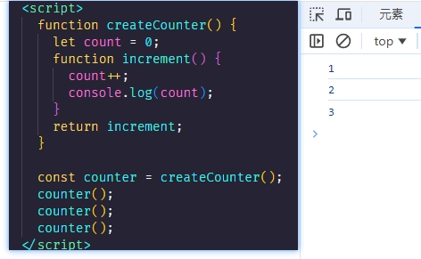

**为什么要使用闭包？**

局部变量无法共享和长久的保存，而全局变量可能造成变量污染。

闭包可以读取函数内部的局部变量，且不会被垃圾回收机制回收，可以长期保存。

**闭包的作用？**

1. 在函数外部可以访问函数内部的局部变量。
2. 可以使函数内部的变量在函数执行结束之后不被销毁 ，长久保存在内存中，不会被垃圾回收机制回收。
3. 使用闭包，可以封装自己的函数代码，实现模块化。
4. 保护：避免命名冲突。
5. 保存：解决循环绑定引发的索引问题。

**闭包的缺点？**
由于垃圾回收器不会将闭包中变量销毁，于是就造成了内存泄露，内存泄露积累多了就容易导致内存溢出。

如何解决：在销毁函数之前，将不使用的局部变量全部删除。

**闭包的应用？**

1. 能够模仿块级作用域。
2. 设计模式中的单例模式。
3. for 循环中的保留 i 的操作。
4. 防抖和节流。
5. 函数柯里化，柯里化是一种将多参数函数转换成一系列单参数函数的技术，闭包是实现柯里化的关键。
6. 在构造函数中定义特权方法。
7. Vue 中数据响应式 Observer 中使用闭包。

## 6、函数柯里化

将一个接受两个参数的加法函数柯里化为两个单参数函数

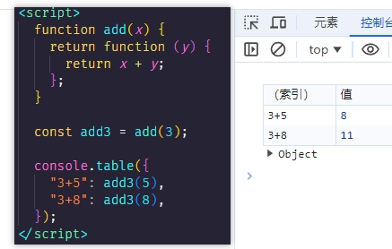

柯里化任何接受多个参数的函数

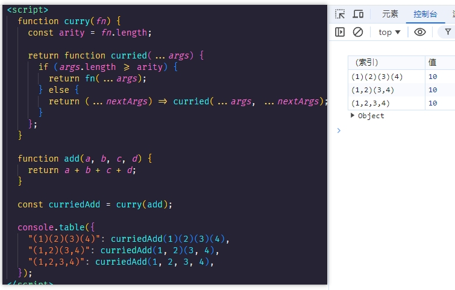

柯里化可以帮助我们简化代码, 假设我们有一个函数需要对数组中的每个元素进行操作

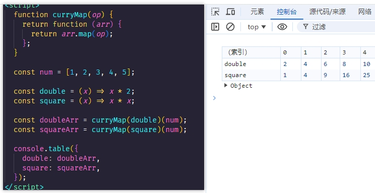

## 7、什么是原型链？

每个函数身上都有一个 `prototype` 的原型对象，并且有一个 `_proto_` 的指针指向下一级原型对象，如果一个对象的属性或方法在自身中找不到，那么就会去 prototype 原型对象中查找，如果还找不到继续向上查找直到 null，当 `_proto_` 指针指向 null 时形成一个链条，这个链条叫做原型链。

在原型链中，对象可以继承原型对象的属性和方法。

如果想在构造函数中添加属性和方法，可以将它们添加到构造函数的 `prototype` 属性中，这样通过该构造函数创建的对象都可以访问到这些属性和方法。

原型链的特点是：对象可以沿着原型链向上查找属性和方法，实现了属性和方法的共享和继承。

其中:

`prototype`是函数的一个属性，每个函数都有一个`prototype`属性，它被称为原型对象。当函数作为构造函数来创建对象实例时，这些实例可以访问构造函数的原型对象上的属性和方法。

`constructor`是原型对象上的一个属性，它指向构造函数本身。它的主要作用是提供了一种从实例对象回溯到其构造函数的方式。

## 8、JS 继承的方法有哪些？优缺点？

JS 继承的方法有以下几种：`原型链继承`、`构造函数继承`、`组合继承`、`原型式继承`和`寄生式继承`，`寄生组合式继承`，ES6 `Class` 实现继承。

继承的目的是：重复利用另外一个对象的属性和方法。

**原型链继承：**

将父类的实例作为子类的原型，从而实现对父类属性和方法的继承。

优点：写法方便简洁，容易理解。

缺点：不能传递参数和共享所有继承的属性和方法，当一个发生改变另外一个随之改变。

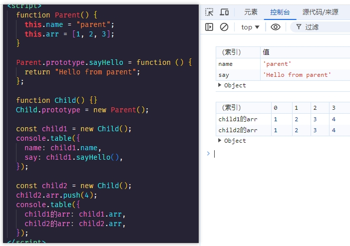

**构造函数继承：**

在子类的构造函数中调用父类的构造函数，使用 apply() 或 call() 方法将父对象的构造函数绑定在子对象上，从而实现对父类实例属性的继承。

优点：解决了原型链继承不能传参的问题和父类的原型共享的问题。

缺点：方法都在构造函数中定义，因此无法实现函数复用。

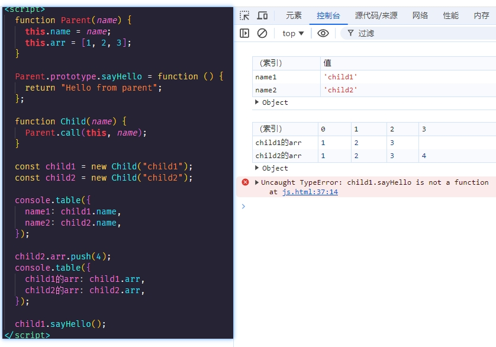

**组合继承：**

将原型链继承和构造函数继承结合起来，既可以实现对父类原型属性和方法的继承，又可以实现对父类实例属性的继承。

优点： 解决了原型链继承和构造函数继承造成的影响。

缺点: 无论在什么情况下，都会调用两次超类型构造函数：一次是在创建子类型原型的时候，另一次是在子类型构造函数内部。

例如下面代码示例中，确实存在调用两次父类构造函数的问题，一次是在设置子类型原型时 new Parent()，另一次是在子类型构造函数内部 Parent.call(this, name)。

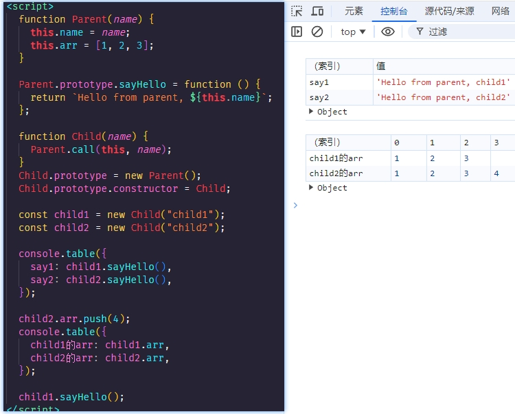

**原型式继承：**

通过创建一个临时构造函数来实现对父类的属性和方法的继承。

优点：不需要单独创建构造函数。

缺点：属性中包含的引用值始终会在相关对象间共享。

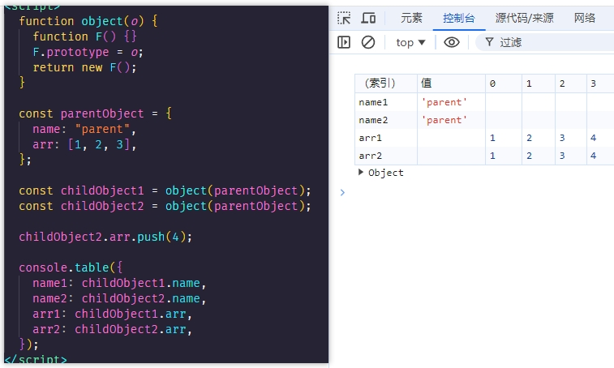

**寄生式继承：**

在原型式继承的基础上，通过在临时构造函数中添加方法和属性，从而实现对父类的继承。

优点：写法简单，不需要单独创建构造函数。

缺点：通过寄生式继承给对象添加函数会导致函数难以重用

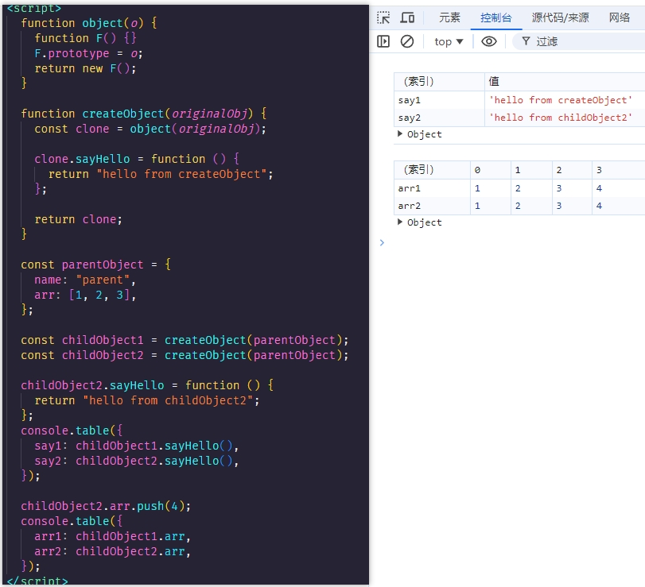

**寄生组合式继承：**

通过借用构造函数来继承属性，通过原型链的混成形式来继承方法。

本质上，就是使用寄生式继承来继承超类型的原型，然后再将结果指定给子类型的原型。

优点：高效率只调用一次父构造函数，并且因此避免了在子原型上面创建不必要，多余的属性。与此同时，原型链还能保持不变。

缺点：代码复杂。

TODO 寄生组合式继承

**ES6 Class 实现继承：**

ES5 的继承，实质是先创造子类的实例对象 this，然后再将父类的方法添加到 this 上面 (Parent.apply(this))。

ES6 的继承机制完全不同，实质是先将父类实例对象的属性和方法加到 this 上面 (所以必须先调用 super 方法)，然后再用子类的构造函数修改 this。需要注意的是，class 关键字只是原型的语法糖，JS 继承仍然是基于原型实现的。

优点：语法简单易懂，操作更方便。

缺点：并不是所有的浏览器都支持 class 关键字。

## 9、new 操作符具体都干了什么?⭐⭐

1. 创建一个新的空对象。
2. 将这个新对象的原型（**`_proto_`**）设置为构造函数的原型对象。
3. 把这个新对象绑定为构造函数中的 this，并执行构造函数，构造函数中的代码可以为这个新对象添加属性和方法。
4. 如果构造函数没有显式地返回一个对象，则 new 操作符返回这个新创建的对象。

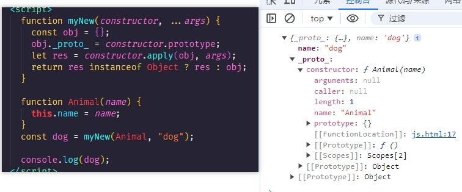
