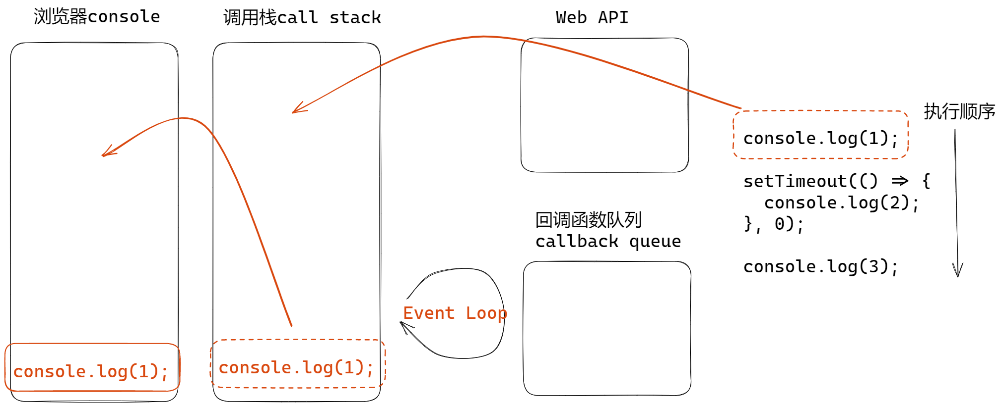
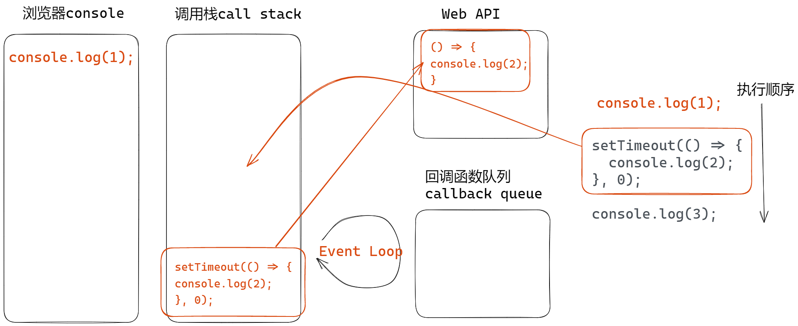
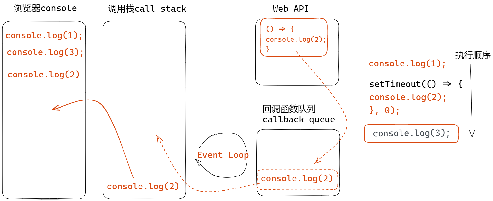
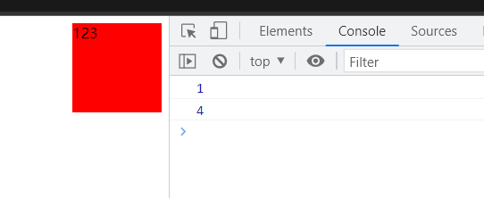
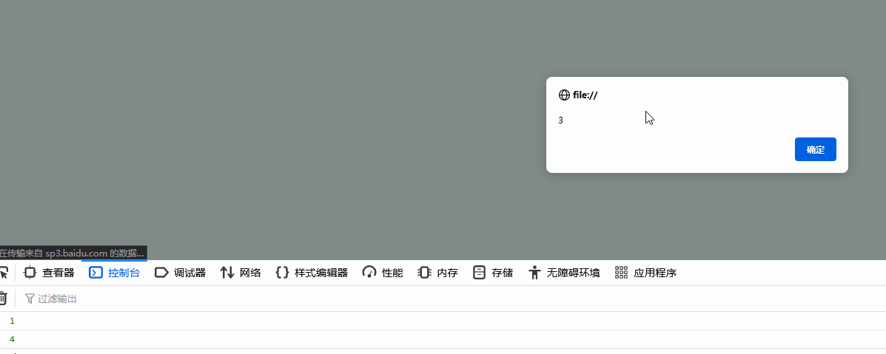
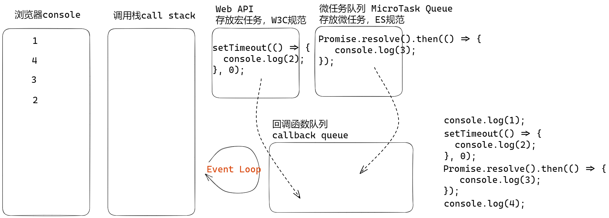

# 事件循环机制

## 定义

[HTML Living Standard](https://html.spec.whatwg.org/multipage/webappapis.html#event-loops)

## 示例1

直接看一段代码，说出打印顺序

```js
console.log(1);
setTimeout(() => {
  console.log(2);
}, 0);
console.log(3);
```

结果

```text
1
3
2
```

## 代码的执行逻辑

**执行 `console.log(1)`**：

1. 自上而下执行，先执行同步代码
2. 遇到`console`，放入调用栈call stack
3. 执行代码，在控制台输出 1



**执行`setTimeout`**:

1. setTimeout 放入调用栈 call stack
2. 发现 setTimeout 是 Web API, 是异步操作
3. 其内部的 console 等待执行



4. 代码继续往下执行 `console.log(3)`, 重复执行`console.log(1)`的逻辑
5. 当**调用栈call stack**里为空，且所有同步代码执行完成，Event Loop开始工作
6. Event Loop 会一遍一遍循环的到**回调函数队列callback queue**中查找可执行代码
7. 如果**回调函数队列**中存在可执行代码，就将这个代码**放入调用栈**中执行，否则还是继续循环查找回调函数队列
8. 当Web API中 setTimeout 的延迟时间到了，内部的**回调函数** 会被放入**回调函数队列**中



### 总结

Event Loop执行过程

1. 同步代码，一行一行的放入**Call Stack**中执行
2. 遇到异步，会先记录下代码，等待执行时机（`setTimeout`, `Ajax`）, 时机到了，会将之前记录的代码放入**Callback Queue**
3. 当**Call Stack**为空（同步代码执行完成）时，**Event Loop**开始执行
4. **Event Loop**轮询查找**Callback Queue**中是否存在可执行代码，如果有，将代码移动到**Call Stack**中执行
5. **Event Loop**如何没有查找到可以执行的代码，会继续轮训查找

## 宏任务和微任务

宏任务(Task)：Promise, async await

微任务(Microtask)：setTimeout, setInerval, Ajax, DOM事件

**区别**：

先执行微任务，后执行宏任务

### 示例2

先看一段代码，说一说输出结果

```js
console.log(1);
setTimeout(() => {
  console.log(2);
}, 0);
Promise.resolve().then(() => {
  console.log(3);
});
console.log(4);
```

输出结果

```text
1
4
3
2
```

### 示例3

```html
<div style="width: 100px; height: 100px; background-color: red">123</div>
<script>
console.log(1);
setTimeout(() => {
  alert(2);
}, 0);
Promise.resolve().then(() => {
  alert(3);
});
console.log(4);
</script>
```

### DOM渲染和宏任务

这里通过测试发现一个问题，**<font color=red>DOM渲染和宏任务的执行时机</font>**

在不同浏览器下表现效果不一样

chrome浏览器，版本 110.0.5481.178 (正式版本)(64位)，宏任务先执行，再DOM渲染



FireFox浏览器，版本110.0.1 (64位)，先DOM渲染，再执行宏任务



### 宏任务和微任务的执行过程

将示例代码中会阻塞代码执行的`alert`换成`console`



其中注意，**微任务队列清空才会去执行宏任务，无论是什么时间加入的**
