# 泛型

## 定义

泛型generics， 宽泛类型。

与之相反的就是确定类型，明确指定了类型，以下就是确定类型

```js
let a: string = 'abc'
let b: boolean = true
```

如果类型不对应就会报错

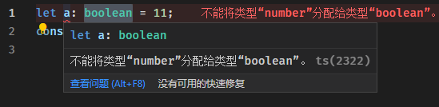

## 使用

### 何时使用泛型

看下面这个例子，定义一个方法foo, 用来返回参数，如果没有指定类型，默认推到是any类型，这违背ts强制类型校验的初衷。

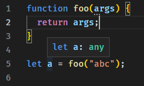

添加上类型，这样就能确定是string类型

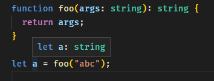

但是如果这时候想要这个函数输出数字类型参数，就会报错，想要实现的话可能就需要在写一个函数专门用来输出数字类型的参数。

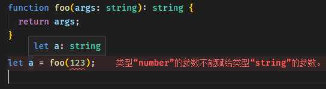

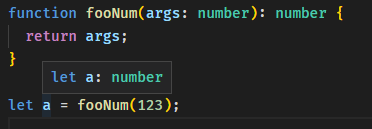

明明是同一种用途的函数，只是因为类型的问题就需要重复写了一个，这时候就可以使用泛型来进行复用。

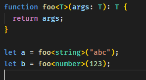

这样就没有报错了。如此说来，泛型就是类型的参数，就可以动态的修改类型。
ts会自动推到foo参数的类型，这样写也是可以的，

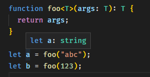

当然推到不出来的还是需要指定一下

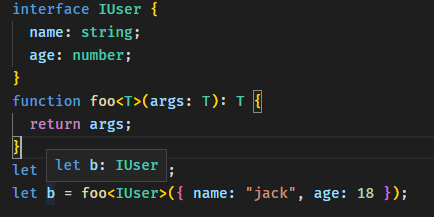

### 类型约束

看这样的例子

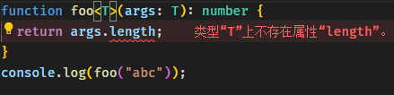

如果为了支持foo函数能返回args.length，就需要约束T的类型，使用extends

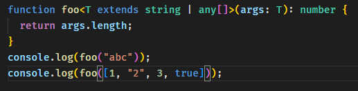

这样一来，原本动态的类型参数T, 也得到了约束限制。
对于数组的写法还可以这样

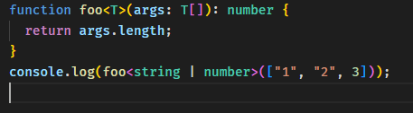

### 在class中使用

假设需要一个类专门来处理数字集合，可以支持添加数字读取数字

````js
class CollectionNum {
  data: number[] = [];
  public set(...args: number[]) {
    this.data.push(...args);
  }
  public get(): number | undefined {
    return this.data.shift();
  }
}
let collectionNumber = new CollectionNum();
collectionNumber.set(1, 2, 3, 4);
console.log(collectionNumber.get()); // 1
````

假设又需要一个类专门来处理字符集合，可以支持添加字符读取字符。

````js
class CollectionStr {
  data: string[] = [];
  public set(...args: string[]) {
    this.data.push(...args);
  }
  public get(): string | undefined {
    return this.data.shift();
  }
}
let collectionString = new CollectionStr();
collectionString.set("abc", "def");
console.log(collectionString.get()); // abc
````

使用泛型进行复用

````js
type TUser = { name: string; age: number };

class Collection<T> {
 data: T[] = [];
 public set(...args: T[]) {
  this.data.push(...args);
 }
 public get(): T | undefined {
  return this.data.shift();
 }
}

let collectionNum = new Collection<number>();
collectionNum.set(1, 2, 3, 4);
console.log(collectionNum.get()); // 1

let collectionStr = new Collection<string>();
collectionStr.set("abc", "def");
console.log(collectionStr.get()); // abc

let collectionUser = new Collection<TUser>();
collectionUser.set({ name: "jack", age: 18 }, { name: "tom", age: 20 });
console.log(collectionUser.get()); // { name: 'jack', age: 18 }
````

### 构造函数中使用

有这样一个类

````js
class User {
  constructor(private _user) {}
  public get() {
    return this._user;
  }
}
let user = new User({ name: "jack", age: 18 });
console.log(user.get()); //  { name: 'jack', age: 18 }
let user1 = new User(123456789);
console.log(user1.get()); // 123456789
````

添加类型进行限制

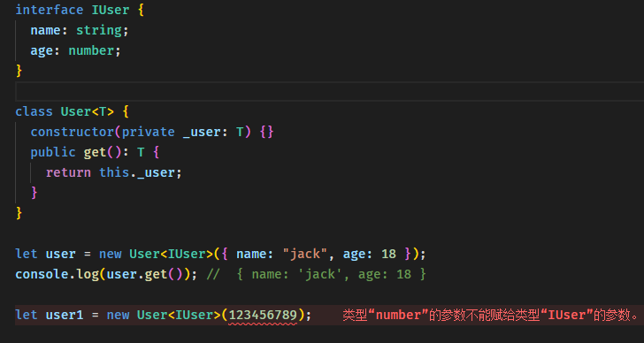

### 接口中使用泛型

定义一个文章的接口，其中是否锁定字段的类型可能是布尔值也可能是数字

````js
interface IArticle<B, C> {
  title: string;
  isLock: B;
  comments: C[];
}
type TComment = {
  content: string;
  author: string;
};

let article: IArticle<boolean, TComment> = {
  title: "这个是文章标题",
  isLock: true,
  comments: [{ content: "这是个评论", author: "jack" }],
};

let article1: IArticle<number, TComment> = {
  title: "这个是文章标题",
  isLock: 1,
  comments: [{ content: "这是个评论", author: "jack" }],
};
````
