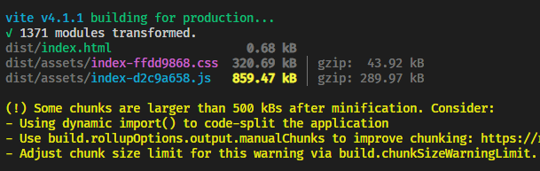
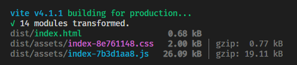
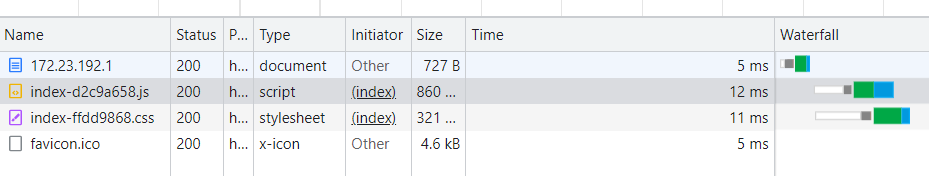
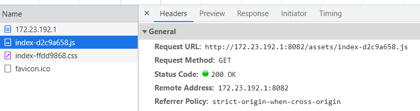
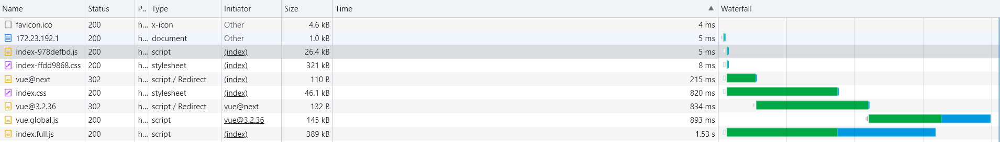
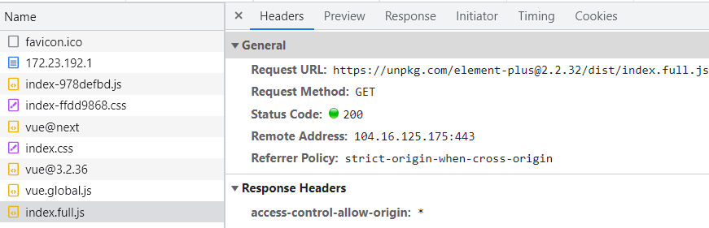

# 第三方包用CDN引入

## CDN定义

CDN主要功能是在不同的地点缓存内容，通过负载均衡技术，将用户的请求定向到最合适的缓存服务器上去获取内容。通过就近访问，加速用户对网站的访问。解决Internet网络拥堵状况，提高用户访问网络的响应速度。

**好处**：

1. 缩短网站加载时间
2. 减少带宽成本
3. 增加内容可用性和冗余
4. 改善网站安全性

对于前端项目，使用cdn可以很好的解决首屏加载优化

## rollup-plugin-external-globals

使用插件 `rollup-plugin-external-globals`

```shell
pnpm add rollup-plugin-external-globals -D
```

在`index.html`中配置cdn, 例如将`element-plus`用cdn资源引入

```html
  <script src="https://unpkg.com/vue@next"></script>
  <!-- import CSS -->
  <link rel="stylesheet" href="https://unpkg.com/element-plus@2.2.32/dist/index.css" />
  <!-- import JavaScript -->
  <script src="https://unpkg.com/element-plus@2.2.32/dist/index.full.js"></script>
```

cdn 信息从[element-plus官网](https://element-plus.org/zh-CN/guide/installation.html#%E6%B5%8F%E8%A7%88%E5%99%A8%E7%9B%B4%E6%8E%A5%E5%BC%95%E5%85%A5)中获取

**注意 element-plus 依赖 vue3, vue3也需要从cdn获取**。

vite.config.js 配置 `rollup-plugin-external-globals`

```js
import externalGlobals from "rollup-plugin-external-globals";

build: {
  rollupOptions: {
    external: ["vue", "element-plus"],
    plugins: [
      externalGlobals({
        vue: "Vue",
        "element-plus": "ElementPlus",
      }),
    ],
  },
},
```

在`main.js`中正常引入`element-plus`使用, 不需要再额外引入css文件

```js
import ElementPlus from "element-plus";
createApp(App).use(ElementPlus);
```

**优化前后对比**:

构建包的**体积**对比：




**资源请求**对比：

没使用cdn会将vue，element-plus全量打包进一个js文件，这里也可以做分包策略

请求js耗时很多




使用cdn时，vue和element-plus会单独走一个请求，构建包的js体积很小请求速度也快，几乎快了50%




开发时按照正常的引入依赖包的方式，只不过需要增加一个打包的配置。这样在打包的时候就会自动识别，并且不去构建这个依赖包，而是变成引用CDN资源。
