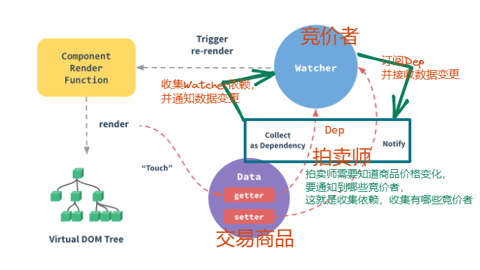

# vue依赖收集

## 为什么需要收集依赖

响应式数据在页面中被多个地方使用，也可能在计算属性中使用，或者是侦听器中有监听操作。

如何能知道这个数据对应的多处使用地方，能在该数据变化的时候同步的全部更新

## vue2收集依赖



Dep要进行依赖收集，并通过一个subs数组，记录观察者Wacher

Watcher 分为 **渲染Watcher**, **计算属性Watcher**, **侦听器Watcher** 三种

1. 渲染Watcher:

```html
<div>{{ msg }}</div>
<div>{{ myMsg }}</div>
```

2. 计算属性Watcher

```js
computed: {
  myMsg() {
    return `${this.msg}!!!`
  }
}
```

3. 侦听器Watcher

```js
watch: {
  msg(newVal) {
    console.log(newVal)
  }
}
```

**依赖收集**：

假设针对以上代码，data中数据

```js
data() {
  return {
    msg: '',
    name: '',
  }
}
```

那依赖收集时，渲染Watcher中用到了msg, myMsg来自计算属性，data中的name没有使用，就不会有nameDep

```js
// dep结果类似二维数组（Map结构）
dep: [
  msgDep: [Watcher4(侦听器依赖), Watcher3(计算属性依赖), Watcher1(渲染)],
  myMsgDep: [Watcher2(渲染)]
]

// Watcher
{
  callback: Function // 数据变化后需要执行的回调
  isRenderWatcher: Boolean
  // 是否是render的Watcher, 是否要触发视图的更新，优先级最低，最后vnode对比，统一更新
}

```

假设data中name变化了，没有任何和name有关的观察者，就不需要任何更新操作，也不会任何监听回调函数

那假设data中msg变化了，就会通知到相关的Watcher

1. 通知侦听器Watcher, 立刻执行配置的回调函数 `console.log(newVal)`
2. 通知计算属性的Watcher, 依赖的msg变化了，需要重新计算
3. myMsg也跟着变化了，那它对应的Watcher2(渲染)，需要执行render更新视图
4. 但是渲染步骤，Watcher1和Watcher2 是最后统一进行，新旧虚拟DOM的对比，完成视图更新

总的来说：

1. `data`中每一个属性都会有一个`dep`, 存放所依赖的`watcher`
2. 当属性变化后通知自己对应的`watcher`去更新
3. 默认在渲染的时候，也就是获取这个响应式数据时，就会触发属性收集依赖`dep.depend()`
4. 当属性发生改变时，触发`watcher`通过`dep.notify()`通知更新

Vue采用的是观察者模式，是一种**一对多**的关系，初始解析渲染时，会进行依赖收集，将渲染Watcher, 计算属性Watcher, 侦听器Watcher 都会收集到dep中，

将来Object.defineProperty监听到数据的变化，会根据依赖关系，派发更新。

### 自己实现依赖收集

在这样一段代码中，写出`createApp`和`ref`函数，从而在点击按钮时能够更新视图。

题目代码，[代码在线查看](https://github1s.com/Zuowendong/my-source-code/blob/de9cef57863427a5ab369a1bf09bfcb5bdde2216/index.html)

index.html

```html
<div id="app">
  <h1>{{ title }}</h1>
  <p>{{ content }}</p>
  <h1>{{ title }}</h1>
  <p>{{ content }}</p>
  <button @click="setTitle">设置标题</button>
  <button @click="setContent">设置内容</button>
</div>
<script type="module" src="./index.js"></script>
```

index.js

```js
import { createApp, ref } from "./my-vue";

createApp("#app", {
 refs: {
  title: ref("this is title"),
  content: ref("this is content"),
 },
 methods: {
  setTitle() {
   this.title.value = "这是标题";
  },
  setContent() {
   this.content.value = "这是内容";
  },
 },
});

```

这里涉及到的知识点

1. 如何写vue Options API
2. 如何写vue Composition API
3. this指向
4. .value怎么做
5. 响应式怎么做 ( 一对多 -> 依赖收集 )

首先新建`createApp`, `ref`文件

[代码在线查看](https://github1s.com/Zuowendong/my-source-code/blob/e50238b1d223cce1f1b650a51e2d2716cc04872d/my-vue/index.js)

my-vue/index.js

```js
import { ref, createRefs } from "./hooks";

export function createApp(el, { refs, methods }) {
 const $el = document.querySelector(el);
 const allNodes = $el.querySelectorAll("*");
 const refSet = createRefs(refs, allNodes);
}
export { ref };
```

my-vue/hooks.js

```js
const reg_var = /\{\{(.+?)\}\}/;

export function ref(defaultValue) {
 const refWrapper = {
  deps: new Set(),
  _value: defaultValue,
  _defaultValue: defaultValue,
 };
 Object.defineProperty(refWrapper, "value", {
  get() {
   return refWrapper._value;
  },
  Set(newValue) {
   refWrapper._value = newValue;
   //update
  },
 });
 return refWrapper;
}

export function createRefs(refs, nodes) {
 nodes.forEach((node) => {
  if (reg_var.test(node.textContent)) {
    const refKey = el.textContent.match(reg_var)[1].trim();
    refs[refKey].deps.add(el);
  }
 });
}
```
