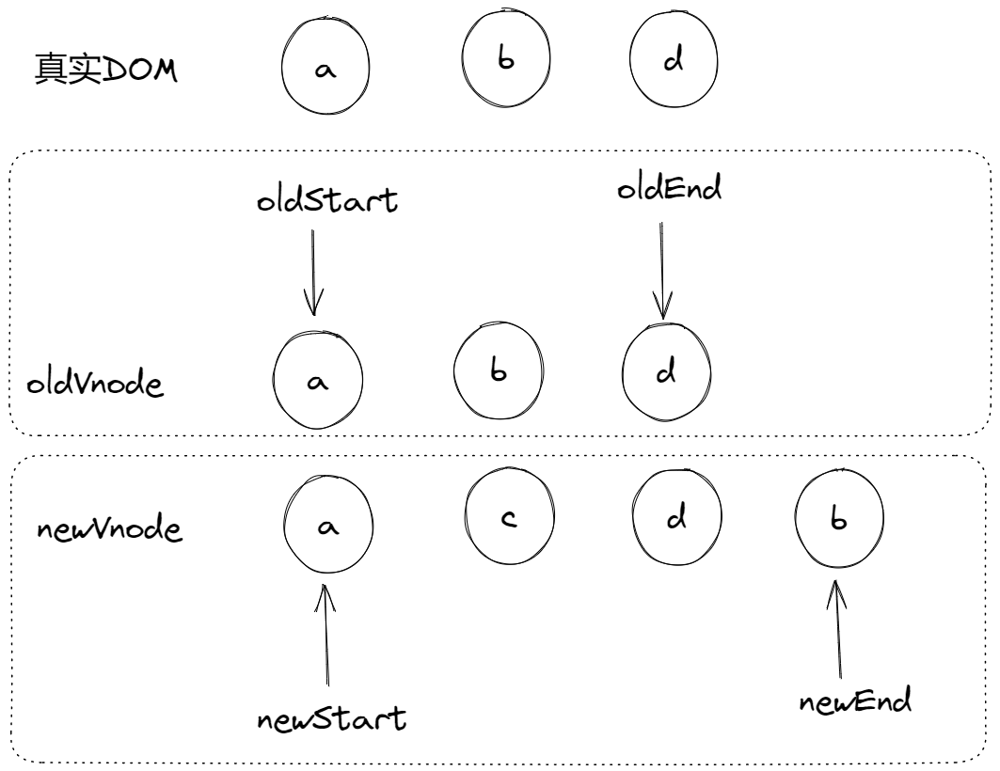
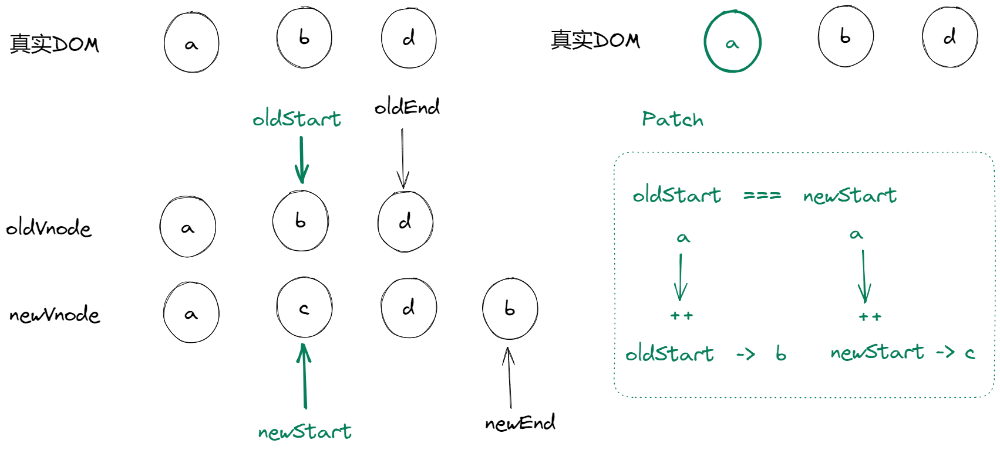
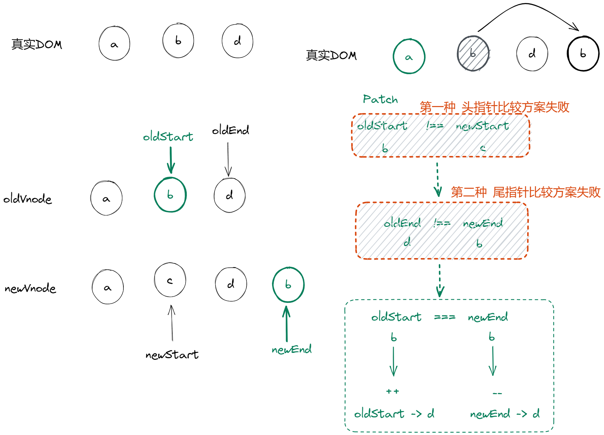
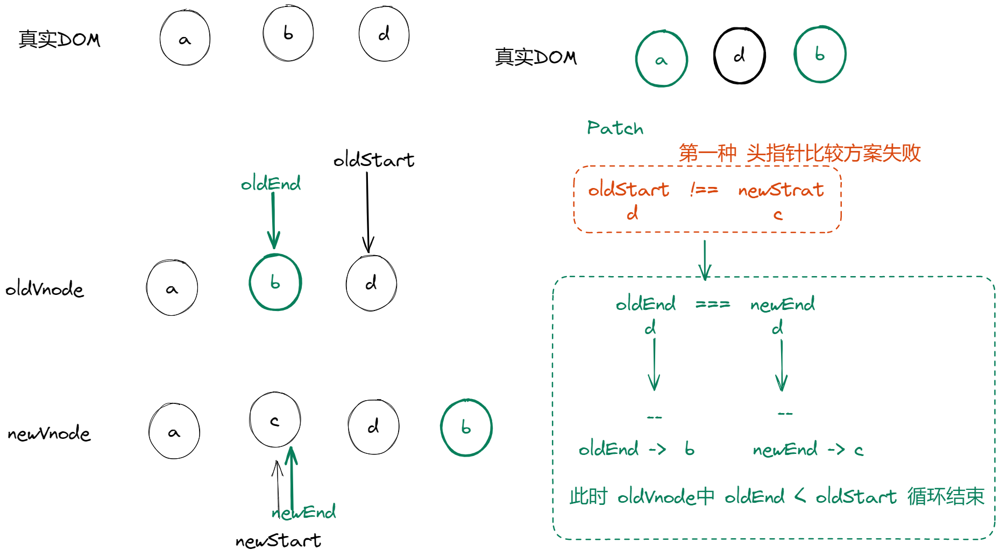
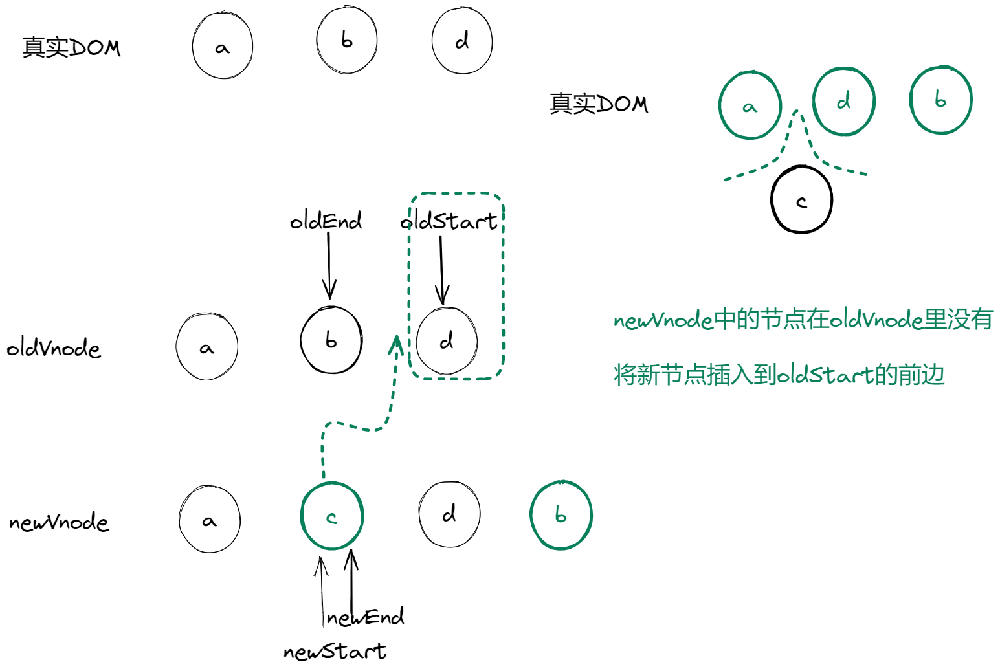

# 图解Diff算法

## 虚拟dom的性能

面试常问，虚拟dom是对真实dom的数据抽象化，实质上就是真实dom的一个js对象描述，那新增了这层抽象真的就提高了性能吗？

详细答案见尤大的回答，[戳这里](https://www.zhihu.com/question/31809713/answer/53544875)

>不要天真地以为 Virtual DOM 就是快，diff 不是免费的，batching 么 MVVM 也能做，而且最终 patch 的时候还不是要用原生 API。
>
>在我看来 Virtual DOM 真正的价值从来都不是性能，而是它
>
>1. 为函数式的 UI 编程方式打开了大门；
>2. 可以渲染到 DOM 以外的 backend，比如 ReactNative。

## 定义

diff算法也叫做最小量更新算法，diff算法的前提是虚拟dom，基于新旧两个虚拟节点进行对比更新操作。

通过这样一种对比算法，对比新旧虚拟dom，比较出哪个虚拟节点更改了，找出这个虚拟节点并只更新它所对应的真实dom节点，不需要更新其他没有更改的节点，实现精准的更新真实dom，从而提升效率。

## 特点

深度优先，同层比较

## 更新策略

vue源码中是用`patch`方法来实现diff算法，对比当前同层的虚拟节点是否为同一种类型的标签

1. 是，继续执行`pathVnode`方法，进行深层对比
2. 否，无需对比直接暴力更新

### patch

```js
function patch(oldVnode, newVnode) {
  // 比较是否为一个类型的节点
  if (sameVnode(oldVnode, newVnode)) {
    // 是：继续进行深层比较
    patchVnode(oldVnode, newVnode)
  } else {
    // 否, 直接更新
    // 旧虚拟节点的真实DOM节点
    const oldEl = oldVnode.el 
     // 获取父节点
    const parentEle = api.parentNode(oldEl)
    // 创建新虚拟节点对应的真实DOM节点
    createEle(newVnode) 
    if (parentEle !== null) {
      // 将新元素添加进父元素
      api.insertBefore(parentEle, vnode.el, api.nextSibling(oEl)) 
       // 移除以前的旧元素节点
      api.removeChild(parentEle, oldVnode.el) 
      // 设置null，释放内存
      oldVnode = null
    }
  }
  return newVnode
}
```

### sameVnode

这里的`sameVnode`方法就是判断新旧虚拟节点是否为同一种类型节点值得比较

```js
function sameVnode(oldVnode, newVnode) {
  return (
    // key值是否一样
    oldVnode.key === newVnode.key && 
    // 标签名是否一样
    oldVnode.tagName === newVnode.tagName && 
    // 是否都为注释节点
    oldVnode.isComment === newVnode.isComment &&
    // 是否都定义了data
    isDef(oldVnode.data) === isDef(newVnode.data) && 
    // 当标签为input时，type必须是否相同
    sameInputType(oldVnode, newVnode) 
  )
}
```

### patchVnode

这个方法就是深层次比较同类型的新老虚拟节点

他做了这些事：

1. 找到对应的真实`dom`，即`el`
2. 判断`newVnode`和`oldVnode`是否指向同一个对象，如果是直接`return`
3. 如何它们都是文本节点并且不相等，将`el`的文本节点设置为`newVnode`的文本节点
4. 如果`oldVnode`有子节点但`newVnode`没有，则删除`el`的子节点
5. 如果`newVnode`有子节点但`oldVnode`没有，则将`newVnode`的子节点转为真实`dom`节点添加到`el`
6. 如果它们都有子节点，进行`updateChildren`方法比较子节点

### updateChildren

采用双指针比较，新老两个子节点集合，各自有首尾两个指针。

1. 旧前 和 新前，匹配：旧前的指针++， 新前的指针++
2. 旧后 和 新后，匹配：旧后的指针--， 新后的指针--
3. 旧前 和 新后，匹配：旧前的指针++， 新后的指针--
4. 旧后 和 新前，匹配：旧后的指针--， 新前的指针++
5. 以上都不满足，再把所有旧子节点的 key 做一个映射到旧节点下标的 key -> index 表，然后用新 vnode 的 key 去找出在旧节点中可以复用的位置

### 示例










