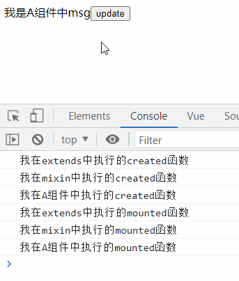
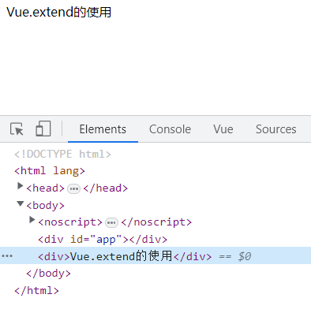
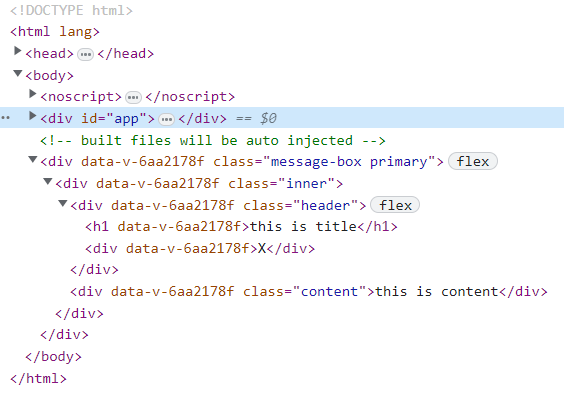

# extends 和 Vue.extend

## extends定义

vue2官网

>允许声明扩展另一个组件 (可以是一个简单的选项对象或构造函数)，而无需使用 Vue.extend。这主要是为了便于扩展单文件组件。

vue3官网

> 使一个组件可以继承另一个组件的组件选项。
从实现角度来看，extends 几乎和 mixins 相同。通过 extends 指定的组件将会当作第一个 mixin 来处理。
然而，extends 和 mixins 表达的是不同的目标。mixins 选项基本用于组合功能，而 extends 则一般更关注继承关系。
同 mixins 一样，所有选项都将使用相关的策略进行合并。

通过官方的描述，可以看到vue2 和 vue3 中的区别，在vue3中更加细化了extend 和 mixin 的区别，extends更加关注继承关系，mixin是组合。
使用时 vue2 和 vue3 相同。

### 示例

extends-msg.js

```js
export const extendsMsg = {
 data() {
  return {
   msg: "我是extends中的msg",
  };
 },
 created() {
  console.log("我在extends中执行的created函数");
 },
 mounted() {
  console.log("我在extends中执行的mounted函数");
 },
 methods: {
  handleUpdate() {
   this.msg = "extends中执行更新msg方法";
  },
 },
};
```

A组件

```js
<template>
 <div>
  <span>{{ msg }}</span>
  <button @click="handleUpdate">update</button>
 </div>
</template>

<script>
import { mixinMsg } from "./mixin-msg";
import { extendsMsg } from "./extends-msg";
export default {
 name: "AView",
 extends: extendsMsg,
 mixins: [mixinMsg],
 data() {
  return {
   msg: "我是A组件中msg",
  };
 },
 created() {
  console.log("我在A组件中执行的created函数");
 },
 mounted() {
  console.log("我在A组件中执行的mounted函数");
 },
 methods: {},
};
</script>
```

输出结果



A组件中引入了extends 和 mixin
通过执行结果可以看出，**vue内部的执行顺序是 extends < mixin < component**

## extends 和 Vue.extend的区别

## Vue.extend定义

引自官网，[戳这里](https://v2.cn.vuejs.org/v2/api/index.html#Vue-extend)

>使用基础 Vue 构造器，创建一个“子类”。参数是一个包含组件选项的对象。
data 选项是特例，需要注意 - 在 Vue.extend() 中它必须是函数

通俗来说，vue.extend是一个全局的api，生成的是vue的子类是实现编程式组件的一个重要途径。

### 如何使用

在main.js下，通过Vue.extend创建一个独立app的一个dom节点，使用基础 Vue构造器，创建一个“子类”。参数是一个包含组件选项的对象。

main.js

```js
var Profile = Vue.extend({
 render(h) {
  return h("div", "Vue.extend的使用");
 },
});
const vm = new Profile().$mount();
document.body.appendChild(vm.$el);
```

输出结果



注：h函数

h函数的使用...

### 示例

通过实现一个弹窗组件来感受以下Vue.extends的使用

在线体验: <https://codesandbox.io/s/vue-extendshi-yong-hbhfkr>

### MessageBox组件

components下新建MessageBox组件

组件的结构，外层 message-box是固定全屏的一个蒙层，在蒙层上inner是展示的弹窗，这个demo里简单的通过header不同样式来展示Vue.extend实现的组件复用的便利。

组件的porps属性中 type来控制不同类型弹窗的展现。

components/MessageBox/MesssageBox.vue

```js
<template>
  <div :class="['message-box', type]">
    <div class="inner">
      <div class="header">
        <h1>{{ title }}</h1>
        <div @click="handleMessageBoxHide">X</div>
      </div>
      <div class="content">{{ content }}</div>
    </div>
  </div>
</template>

<script>
  export default {
    name: "MessageBox",
    props: {
      title: {
        type: String,
        default: "这个是标题",
      },
      content: {
        type: String,
        default: "这个是内容",
      },
      type: {
        type: String,
        default: "primary",
        validator(value) {
          return ["primary", "success", "warn", "danger"].includes(value);
        },
      },
    },
    methods: {
      handleMessageBoxHide() {
        this.$messageBox.hide(() => {
          console.log("hidden");
        });
      },
    },
  };
</script>

<style scoped>
  body {
    margin: 0;
  }
  h1 {
    margin: 0;
    font-weight: normal;
  }
  .message-box {
    position: fixed;
    top: 0;
    left: 0;
    width: 100%;
    height: 100%;
    background-color: rgba(0, 0, 0, 0.5);
    display: flex;
    align-items: center;
    justify-content: center;
  }
  .inner {
    width: 500px;
    background-color: #fff;
    box-shadow: 1px 3px 5px #ededed;
    border-radius: 5px;
    overflow: hidden;
  }
  .header {
    width: 100%;
    height: 40px;
    display: flex;
    align-items: center;
    justify-content: space-between;
    color: #333;
  }
  .header div {
    width: 30px;
    text-align: center;
    cursor: pointer;
  }

  .primary .header {
    background-color: blue;
    color: #fff;
  }
  .success .header {
    background-color: green;
    color: #fff;
  }
  .warn .header {
    background-color: orange;
    color: #333;
  }
  .danger .header {
    background-color: red;
    color: #fff;
  }

  .content {
    min-height: 100px;
  }
</style>
```

同级下新建index.js作为插件导出组件

components/MessageBox/index.js

```js
import _MessageBox from "./MessageBox.vue";

export default {
 install(Vue) {
  let messageBox = null;
  Vue.component(_MessageBox.name, _MessageBox);
  Vue.prototype.$messageBox = {
   show,
   hide,
   info({ title, content }, callback) {
    this.show({ title, content, type: "primary" }, callback);
   },
   success({ title, content }, callback) {
    this.show({ title, content, type: "success" }, callback);
   },
   warn({ title, content }, callback) {
    this.show({ title, content, type: "warn" }, callback);
   },
   danger({ title, content }, callback) {
    this.show({ title, content, type: "danger" }, callback);
   },
  };

  function show(props, callback) {
   if (!messageBox) {
    const MessageBox = Vue.extend({
     render(h) {
      return h("message-box", {
       props: { ...props },
      });
     },
    });
    messageBox = new MessageBox();
    this.vm = messageBox.$mount();
    document.body.appendChild(this.vm.$el);
    callback && callback();
   }
  }

  function hide(callback) {
   document.body.removeChild(this.vm.$el);
   messageBox.$destroy();
   messageBox = null;
   this.vm = null;
   callback && callback();
  }
 },
};
```

在components下整体导出所有组件

```js
import { MessageBox } from "./components";
Vue.use(MessageBox);
```

App.vue中使用MessageBox组件

```js
<template>
  <div id="app">
    <button @click="handleOpenMessageBox('primary')">show</button>
    <button @click="handleOpenMessageBox('success')">success</button>
    <button @click="handleOpenMessageBox('warn')">warn</button>
    <button @click="handleOpenMessageBox('danger')">danger</button>
  </div>
</template>

<script>
  export default {
    name: "App",
    components: {},
    methods: {
      handleOpenMessageBox(type) {
        this.$messageBox.show({ title: "this is title", content: "this is content", type }, () => {
          console.log("open");
        });
      },
    },
  };
</script>
```

### MessageBox组件的DOM

在app同级下新增了一个dom节点


