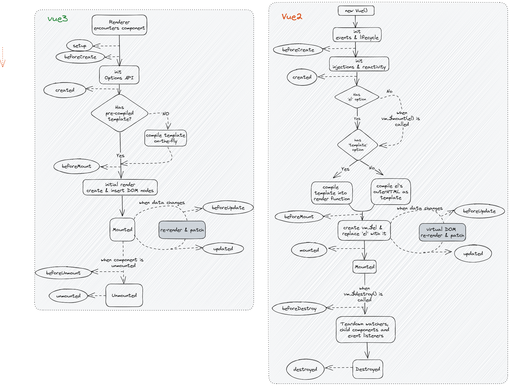
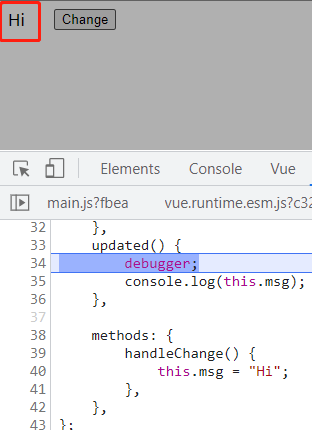
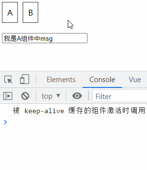
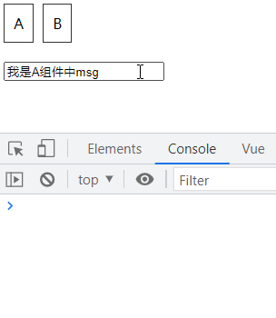
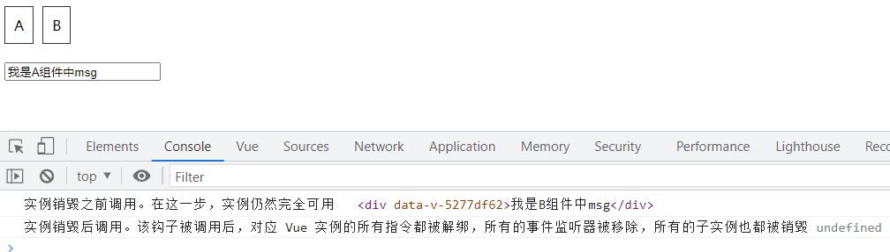

# 简述vue生命周期

## 回答思路

1. 概念
2. 列举生命周期的各个阶段
3. 简述整个流程
4. 结合实践
5. vue3中的变化

## 概念
>
> 每个 Vue 实例在被创建时都要经过一系列的初始化过程——例如，需要设置数据监听、编译模板、将实例挂载到 DOM 并在数据变化时更新 DOM 等。同时在这个过程中也会运行一些叫做生命周期钩子的函数，这给了用户在不同阶段添加自己的代码的机会。

## 生命周期的各个阶段

生命周期一共分8个阶段，创建前后，挂载前后，更新前后，销毁前后。以及一些特殊场景下的生命周期，vue3中新增了3个用于调试和服务端渲染场景

|v2生命周期| v3生命周期| 描述|
|--|--|--|
beforeCreate |beforeCreate |组件实例被创建之初|
created |created |组件实例已经完全创建|
beforeMount |beforeMount |组件挂载之前|
mounted| mounted |组件被挂载到实例之后|
beforeUpdate| beforeUpdate |组件数据发生变化，更新之前|
updated| updated |组件数据更新之后|
beforeDestroy |beforeUnmounted |组件实例销毁之前|
destroy| unmounted| 组件实例销毁之后|
activated |activated |keep-alive缓存的组件被激活时|
deactivated |deactivated |keep-alive缓存的组件停用时调用|
errCaptured |errCaptured |捕获一个来自子孙组件错误时调用|
/ |renderTracked |调试钩子，响应式依赖被收集时调用
/ |renderTriggered |调试钩子，响应式依赖被触发时调用
/ |serverPrefetch |ssr only, 组件实例在服务器上被渲染前调用

## 简述整个流程

**vue2和vue3两个生命周期图的对比**



**在每个生命周期中代码示例**

### beforeCreate

在实例初始化之后, 进行数据侦听和事件/侦听器的配置之前同步调用

```js
data() {
  return {
    msg: "Hello",
  };
},
beforeCreate() {
  console.log(this.msg); // undefined
},
```

### created

在实例创建完成后被立即同步调用。在这一步中，实例已完成对选项的处理，意味着以下内容已被配置完毕：数据侦听、计算属性、方法、事件/侦听器的回调函数。然而，挂载阶段还没开始，且 $el property 目前尚不可用。

```js
<div id="app">
  <span id="span">{{ msg }}</span>
</div>
data() {
  return {
    msg: "Hello",
  };
},
created() {
  console.log(this.msg); // Hello
  console.log(document.getElementById("span")); // null
},
```

### beforeMount

在挂载开始之前被调用：相关的 render 函数首次被调用。

```js
beforeMount() {
  console.log(this.msg); // Hello
  console.log(document.getElementById("span")); // null
},
```

### mounted

实例被挂载后调用，这时 el 被新创建的 vm.$el 替换了。如果根实例挂载到了一个文档内的元素上，当 mounted 被调用时 vm.$el 也在文档内。

注意 mounted 不会保证所有的子组件也都被挂载完成。如果你希望等到整个视图都渲染完毕再执行某些操作，可以在 mounted 内部使用 vm.$nextTick

```js
mounted() {
  console.log(document.getElementById("span")); // <span id="span">Hello</span>
},
```

### beforeUpdate

在数据发生改变后，DOM 被更新之前被调用。

在beforeUpdate中打断点，发现数据已经更新，但是视图dom没有更新

```js
<div id="app">
  <span id="span">{{ msg }}</span>
  <button @click="handleChange">Change</button>
</div>
data() {
  return {
   msg: "Hello",
  };
},

beforeUpdate() {
  console.log(this.msg);
  debugger;
},
```

### updated

在数据更改导致的虚拟 DOM 重新渲染和更新完毕之后被调用。

当这个钩子被调用时，组件 DOM 已经更新, 通过断点方式，发现视图上dom已经更新。

```js
updated() {
  debugger;
  console.log(this.msg);
},
```



### activated

被 keep-alive 缓存的组件激活时调用

创建两个组件AB,

组件A

```js
<template>
  <div>
    <input v-model="msg" />
  </div>
</template>
<script>
  export default {
    name: "AView",
    data() {
      return {
        msg: "我是A组件中msg",
      };
    },
    activated() {
      console.log("被 keep-alive 缓存的组件激活时调用");
    },
    deactivated() {
   console.log("被 keep-alive 缓存的组件失活时调用");
  },
  };
</script>
```

组件B

```js
<template>
  <div>{{ msg }}</div>
</template>
<script>
export default {
  name: "BView",
  data() {
    return {
      msg: "我是B组件中msg",
    };
  },
};
</script>
```

在App中使用AB组件做切换

```js
<template>
  <div id="app">
    <div class="tabs">
      <span @click="handleSwitch('A')">A</span>
      <span @click="handleSwitch('B')">B</span>
    </div>
    <keep-alive>
      <component :is="currentComponent" />
    </keep-alive>
  </div>
</template>
<script>
import AView from "./components/A.vue";
import BView from "./components/B.vue";
export default {
  name: "App",
  components: { AView, BView },
  data() {
    return {
      currentComponent: AView,
    };
  },
  methods: {
    handleSwitch(type) {
      switch (type) {
        case "A":
          this.currentComponent = AView;
          break;
        case "B":
          this.currentComponent = BView;
          break;
        default:
          break;
      }
    },
  },
};
</script>
<style>
# app {
  width: 500px;
}
.tabs span {
  display: inline-block;
  margin: 0 10px 20px 0;
  cursor: pointer;
  padding: 10px;
  border: 1px solid #333;
  user-select: none;
}
.tabs span:active {
  color: red;
}
</style>
```

**加了keep-alive的效果**



**没有加keep-alive的效果**



### beforeDestroy & Destroyed

1. beforeDestroy 实例销毁之前调用。在这一步，实例仍然完全可用。
2. Destroyed 实例销毁后调用。该钩子被调用后，对应 Vue 实例的所有指令都被解绑，所有的事件监听器被移除，所有的子实例也都被销毁。

示例

修改上述例子中B组件，并去掉App中keep-alive的包裹

```js
<template>
  <div ref="bBox">{{ msg }}</div>
</template>
<script>
export default {
  name: "BView",
  data() {
    return {
      msg: "我是B组件中msg",
    };
  },
  beforeDestroy() {
    console.log("实例销毁之前调用。在这一步，实例仍然完全可用", this.$refs.bBox);
  },
  destroyed() {
    console.log(
      "实例销毁后调用。该钩子被调用后，对应 Vue 实例的所有指令都被解绑，所有的事件监听器被移除，所有的子实例也都被销毁",
      this.$refs.bBox
    );
  },
};
</script>
```

从B切换到A, B组件的实例销毁



## 结合实践

1. `beforeCreate` 通常用于一些插件开发中执行初始化任务
2. `created` 组件初始化完毕，可以访问各种数据，获取接口数据等
3. `mounted` dom已经创建，可用于获取访问数据和dom元素，访问子组件状态
4. `beforeUpdate` 此时view层还没更新，可用于获取更新前的各种状态
5. `updated` 完成view的更新，更新后所有状态都是最新的
6. `beforeUnmounted` 实例被销毁前调用，可用于一些订阅器或订阅的取消
7. `unmounted` 销毁一个实例，可清理它与其他实例的链接，解绑它的全部指令和事件监听器

## vue3中变化

### setup和created谁先执行

从流程图中可知 `setup` 先于 `created` 执行

### setup中为什么没有beforeCreate和created

`setup` 的执行时机比 `beforeCreate` `created` 早

## 源码

vue2 [源码戳这里](https://github1s.com/vuejs/vue/blob/HEAD/src/core/instance/init.ts#L62-L66)

```js
initLifecycle(vm)
initEvents(vm)
initRender(vm)
callHook(vm, 'beforeCreate', undefined, false /* setContext */)
initInjections(vm) // resolve injections before data/props
initState(vm)
initProvide(vm) // resolve provide after data/props
callHook(vm, 'created')
```

vue3 [源码戳这里](https://github1s.com/vuejs/core/blob/HEAD/packages/runtime-core/src/componentOptions.ts#L605)
