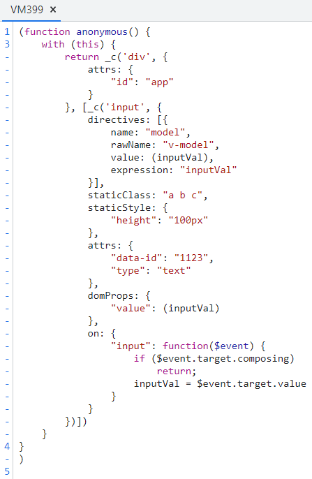
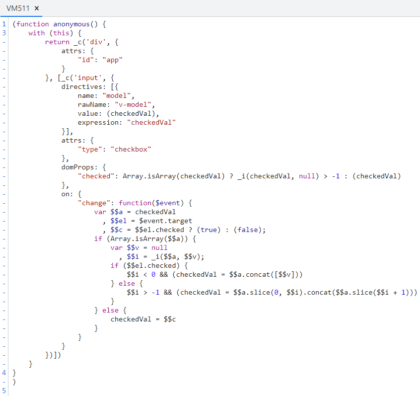
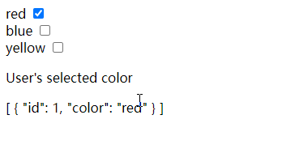
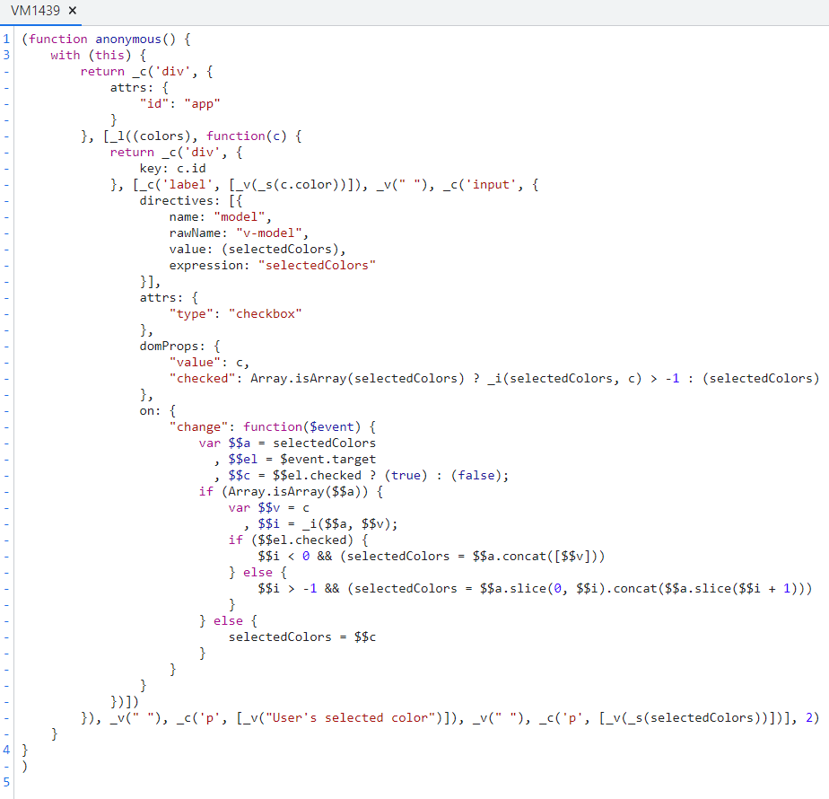
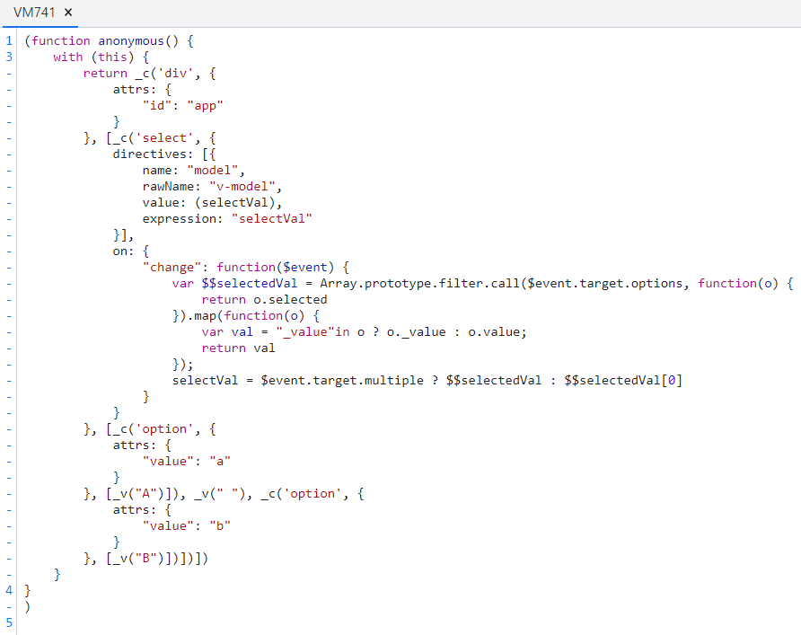
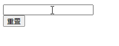
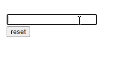
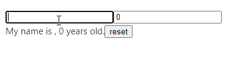

# v-model 双向绑定以及原理

## 回答思路

1. 双向绑定的定义
2. 好处
3. 在哪里使用
4. 如何使用
5. 使用细节和实现原理

### 定义

vue 中双向绑定是一个指令 v-model，可以绑定一个动态值到视图，视图上变化也会修改该值。

v-model是一个语法糖，负责监听用户的输入事件以更新数据，它相当于：

1. input 和 textarea的 :value @input
2. checkbox 和 radio的 :check  @change
3. select的 :value @change

### 好处

使用v-model可以减少大量繁琐的事件处理代码，提高开发效率，代码可读性也更好。

### 在哪里使用

v-model指令在表单`<input>`、`<textarea>` 及 `<select>`  元素上创建双向数据绑定。

### 如何使用

原生的表单项可以直接使用v-model
自定义组件实现v-model, 需要在组件内绑定value并处理输入事件

### 源码

通过测试，输出包含v-model模板的组件render渲染函数中，它是被转换成一个value属性以及一个事件监听，事件回调中更新绑定的变量数据。

**测试input**

新建一个index.html, 下载开发版vue，下载地址，[戳这里](https://v2.cn.vuejs.org/v2/guide/installation.html#%E7%9B%B4%E6%8E%A5%E7%94%A8-lt-script-gt-%E5%BC%95%E5%85%A5)

```js
<div id="app">
 <input class="a b c" style="height: 100px" data-id="1123" type="text" v-model='inputVal'></input>
</div>

<script src="./vue.js"></script>
<script>
  const app = new Vue({
    el: '#app',
    data: {
      inputVal: 'input value',
    }
  })
  console.log(app.$options.render);
</script>
```

输出结果



1. 普通的节点被编译成了可执行 _c 函数，这里div 就是最外层的app容器，它的属性attrs里有id值
2. 里面的子节点也是个元素节点，标签名input
  a. class值放在了staticClass
  b. 行内样式放在了staticStyle
  c. type data 属性都放在了attrs
3. v-mode指令放在了 directives里，它对应实现的就是input自身的domProps里的value，是它的input事件
4. 在input事件里设置data中定义的inputVal，也是挂载了实例上，直接赋值input输入的值，实现了更新

**测试checkbox**

```js
<div id="app">
  <input type="checkbox" v-model='checkedVal'></input>
</div>

<script src="./vue.js"></script>
<script>
  const app = new Vue({
   el: '#app',
   data: {
   checkedVal: true,
   }
 })
 console.log(app.$options.render);
</script>
```

输出结果



这里对checked判断数组情况，是因为存在以下这种情况

```js
<div id="app">
  <div v-for="c in colors" :key="c.id">
    <label>{{c.color}}</label>
    <input type="checkbox" v-model="selectedColors" :value="c" />
  </div>
  <p>User's selected color</p>
  <p>{{selectedColors}}</p>
</div>

<script src="./vue.js"></script>
<script>
  const app = new Vue({
    el: "#app",
    data: {
      colors: [
        { id: 1, color: "red" },
        { id: 2, color: "blue" },
        { id: 3, color: "yellow" },
      ],
      selectedColors: [{ id: 1, color: "red" }],
    },
  });
  console.log(app.$options.render);
</script>
```





**测试下拉框**

```js
<div id="app">
  <select v-model="selectVal">
    <option value="a">A</option>
    <option value="b">B</option>
  </select>
</div>

<script src="./vue.js"></script>
<script>
  const app = new Vue({
    el: "#app",
    data: {
      selectVal: "a",
    },
  });
  console.log(app.$options.render);
</script>
```

输出结果



## 扩展问题

### 自定义组件如何实现v-model，使用时想要改变事件名或属性名应该怎么做

1. 先来看一下普通父子组件 props/emit 传值

子组件B

```js
<template>
 <div>
  <input type="text" v-model="BMsg" @input="handleInput" />
 </div>
</template>

<script>
export default {
 name: "BView",
 props: {
  msg: [String],
 },
 data() {
  return {
   BMsg: "",
  };
 },
 watch: {
  msg: {
   handler(val) {
    this.BMsg = val;
   },
   immediate: true,
  },
 },
 methods: {
  handleInput() {
   this.$emit("change", this.BMsg);
  },
 },
};
</script>
```

父组件A

```js
<template>
 <div>
  <BView :msg="AMsg" @change="changeInput" />
  <button @click="handleReset">重置</button>
  <span>{{ AMsg }}</span>
 </div>
</template>

<script>
import BView from "./B.vue";
export default {
 name: "AView",
 components: { BView },
 data() {
  return {
   AMsg: "",
  };
 },
 methods: {
  changeInput(val) {
   this.AMsg = val;
  },
  handleReset() {
   this.AMsg = "";
  },
 },
};
</script>
```



以上props/emit实现组件的双绑，但是不允许子组件直接修改父组件传来的值，所以在子组件中接收props是不能直接绑定在视图上，需要自定义一个变量watch监听父组件传入的目标值，进行赋值操作，这样才可以更新视图。

2. sync修饰符

官网 [戳这里](https://v2.cn.vuejs.org/v2/guide/components-custom-events.html#sync-%E4%BF%AE%E9%A5%B0%E7%AC%A6)

基本使用，.sync前名称是自定义的，通过update加上这个自定义名称触发对象的事件
相较于 props/emit方式，写法上修改如下，父组件代码量减少

父组件A

```js
<template>
 <div>
  <BView :msg.sync="AMsg" />
  <button @click="handleReset">重置</button>
  <span>{{ AMsg }}</span>
 </div>
</template>

<script>
import BView from "./B.vue";
export default {
 name: "AView",
 components: { BView },
 data() {
  return {
   AMsg: "",
  };
 },
 methods: {
  handleReset() {
   this.AMsg = "";
  },
 },
};
</script>
```

子组件B

```js
<template>
 <div>
  <input type="text" v-model="BMsg" @input="handleInput" />
 </div>
</template>

<script>
export default {
 name: "BView",
 props: {
  msg: [String],
 },
 data() {
  return {
   BMsg: "",
  };
 },
 watch: {
  msg: {
   handler(val) {
    this.BMsg = val;
   },
   immediate: true,
  },
 },
 methods: {
  handleInput() {
   this.$emit("update:msg", this.BMsg);
  },
 },
};
</script>
```

结果一致

3. v-model

官网，[戳这里](https://v2.cn.vuejs.org/v2/guide/components-custom-events.html#%E8%87%AA%E5%AE%9A%E4%B9%89%E7%BB%84%E4%BB%B6%E7%9A%84-v-model)

父组件A，代码量最少

```js
<template>
 <div>
  <BView v-model="AMsg" />
  <button @click="handleReset">重置</button>
  <span>{{ AMsg }}</span>
 </div>
</template>

<script>
import BView from "./B.vue";
export default {
 name: "AView",
 components: { BView },
 data() {
  return {
   AMsg: "",
  };
 },
 methods: {
  handleReset() {
   this.AMsg = "";
  },
 },
};
</script>
```

子组件B

**model选项中定义prop属性名和event事件名，这样就解决了使用时想要改变事件名或属性名**

```js
<template>
 <div>
  <input type="text" v-model="BMsg" @input="handleInput" />
 </div>
</template>

<script>
export default {
 name: "BView",
 props: {
  msg: [String],
 },
 model: {
  prop: "msg",
  event: "changeBMsg",
 },
 data() {
  return {
   BMsg: "",
  };
 },
 watch: {
  msg: {
   handler(val) {
    this.BMsg = val;
   },
   immediate: true,
  },
 },
 methods: {
  handleInput() {
   this.$emit("changeBMsg", this.BMsg);
  },
 },
};
</script>
```

### v-model 和 sync修饰符 有什么区别

相同：

1. 本质一样，都是监听一个触发事件更新绑定到视图的值

区别

1. 一个组件可以多个sync修饰符
2. v-model一个组件只能有一个

### vue3中的变化

官网， [戳这里](https://cn.vuejs.org/guide/components/v-model.html#component-v-model)

vue3中去掉了 .sync修饰符，只需要使用 v-model实现双向绑定

vue2 中 v-model只能绑定一个属性，vue3 中支持绑定多个

1. **普通实现，和vue2一样**

子组件B

```js
<template>
  <input type="text" :value="modelValue" @input="$emit('update:modelValue', $event.target.value)" />
</template>

<script setup>
defineProps(["modelValue"]);
defineEmits(["update:modelValue"]);
</script>
```

父组件A

```js
<template>
  <BView v-model="msg" />
  <span>{{ msg }}</span>
  <button @click="msg = ''">reset</button>
</template>

<script setup>
import { ref } from "vue";
import BView from "./B.vue";
let msg = ref("");
</script>
```

输出结果



2. **使用一个可写的，同时具有 getter 和 setter 的 computed 属性**

默认情况下，v-model 在组件上都是使用 modelValue 作为 prop，并以 update:modelValue 作为对应的事件。通过给 v-model 指定一个参数来更改这些名字

父组件A

```js
<template>
 <div>
  <BView v-model:msg="msg" />
  <span>{{ msg }}</span>
  <button @click="msg = ''">reset</button>
 </div>
</template>

<script setup>
import { ref } from "vue";
import BView from "./B.vue";
let msg = ref("");
</script>
```

子组件B

```js
<template>
 <div>
  <input type="text" v-model="inputVal" />
 </div>
</template>

<script setup>
import { computed } from "vue";
const props = defineProps(["msg"]);
const emit = defineEmits(["update:msg"]);

const inputVal = computed({
 get() {
  return props.msg;
 },
 set(value) {
  emit("update:msg", value);
 },
});
</script>
```

结果一致

3. **绑定多个属性**

```js
<template>
 <div>
  <input type="text" v-model="inputName" />
  <input type="text" v-model="inputAge" />
 </div>
</template>

<script setup>
import { computed } from "vue";
const props = defineProps({
 name: String,
 age: Number,
});
const emit = defineEmits(["update:name", "update:age"]);

const inputName = computed({
 get() {
  return props.name;
 },
 set(value) {
  emit("update:name", value);
 },
});
const inputAge = computed({
 get() {
  return props.age;
 },
 set(value) {
  emit("update:age", value);
 },
});
</script>
```

父组件A

```js
<template>
 <div>
  <BView v-model:name="myName" v-model:age="myAge" />
  <span>My name is {{ myName }}, {{ myAge }} years old.</span>
  <button @click="handleReset">reset</button>
 </div>
</template>

<script setup>
import { ref } from "vue";
import BView from "./B.vue";
let myName = ref("");
let myAge = ref(0);
function handleReset() {
 myName.value = "";
 myAge.value = 0;
}
</script>
```

输出结果


