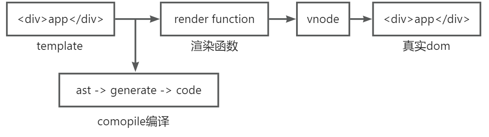

# 虚拟DOM

现在前端框架几乎都引入了虚拟DOM来对真实dom进行抽象，它能极大增强框架在性能方面和扩展方面的表现。

## 回答思路

1. vnode是什么
2. 引入vnode的好处
3. vnode如何生成，如何转换成真实dom
4. 在后续diff中的作用

## vnode是什么

官方文档，[戳这里](https://cn.vuejs.org/guide/extras/rendering-mechanism.html#virtual-dom)

虚拟dom就是虚拟的dom对象，它本身是一个js对象，通过不同的属性描述一个视图结构。

相对于真实dom来说，虚拟dom是更加轻量，在未来计算遍历的过程中更加快速。

## 引入vnode的好处

将真实dom抽象成虚拟dom，能够有效的减少dom操作次数，从而提高程序性能

但需要这里的提升性能，不能断言一定提升了性能

面试常问，虚拟dom是对真实dom的数据抽象化，实质上就是真实dom的一个js对象描述，那新增了这层抽象真的就提高了性能吗？

详细答案见尤大的回答，[戳这里](https://www.zhihu.com/question/31809713/answer/53544875)

>不要天真地以为 Virtual DOM 就是快，diff 不是免费的，batching 么 MVVM 也能做，而且最终 patch 的时候还不是要用原生 API。
>
>在我看来 Virtual DOM 真正的价值从来都不是性能，而是它
>
>1. 为函数式的 UI 编程方式打开了大门；
>2. 可以渲染到 DOM 以外的 backend，比如 ReactNative。

1. 直接操作真实dom是有限制的，比如diff，clone等操作，一个真实dom节点上包含了很多信息，直接对其进行diff操作，会多了很多额外的一些比较，进行clone操作时会将dom上所有信息拷贝，也是没有必要的。如果这些操作的目标都是对象的话，就会变得简单。
2. 操作真实dom是昂贵的，频繁的操作dom会引起浏览器页面的重绘和回流，通过vnode进行中间处理，可以极大的减少直接操作dom的次数，减少页面的重绘和回流。
方便跨平台。
3. 在同一vnode节点可以在不同平台的上转换，这提供一个机会，可以针对不同平台的实现不同的渲染器，在不同的渲染器上实现不同的操作，这就实现了跨平台。
4. vue3中允许开发者基于vnode自定义渲染器renderer，以便针对不同平台进行渲染。

## vnode如何生成，如何转换成真实dom

流程图

在vue中常会为组件编写模板template，其实写的这个template是一个render渲染函数

template会通过vue中的compile编译器，经过一系列的转换，将这个模板编译成渲染函数

在挂载mount过程中，会调用render渲染函数，返回的就是vnode

后续在通过patch过程转换成真实dom

在挂载mount结束后，vue程序进入更新流程

如果存在响应式数据发生变化的时候，会引起组件重新render，会产生新的vnode

与上一次渲染的旧的vnode，通过diff就能得到变化的地方，从而转换成最小量的dom操作，高效更新视图
