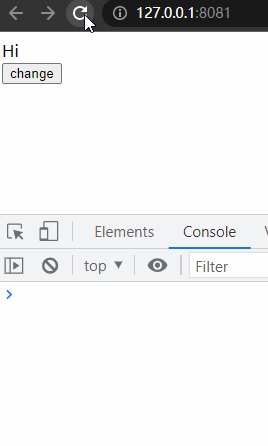
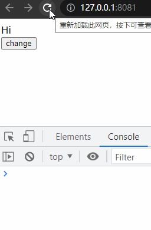

# watch 和 computed

## 定义

**watch**:

侦听器，可以侦测指定响应式数据的变化并执行相应逻辑。

常见用法是传递一个函数执行，watch没有返回值，但可以执行异步操作等复杂逻辑处理

**computed**:

计算属性，依赖组件数据计算出新数据。

常见用法是设置一个函数，返回计算结果，它与methods的差异是computed具有缓存性，依赖的属性值没有变化时不会重新计算。

### computed 缓存的实现原理

在 Vue 中，computed 的缓存实现原理是基于依赖收集和标记位（dirty）的。

当一个 computed 创建时，Vue 内部会自动建立一个 Dep 对象用于管理其依赖关系。在 computed 中访问的响应式数据，都会被添加到该 computed 的依赖列表中。当这些依赖数据发生变化时，它们会通知 computed 执行更新操作。

在 computed 首次执行时，会调用其 getter 函数进行计算，并将计算结果缓存下来。此后，只要 computed 依赖的响应数据没有发生变化，就无需重新计算，直接返回之前缓存的计算结果即可。如果依赖数据发生了变化，computed 会将自身标记为“dirty”，表示计算结果已过期，需要重新计算。

在下一次访问 computed 时，如果 computed 被标记为“dirty”，则会重新调用其 getter 函数进行计算，并缓存新的计算结果。如果 computed 没有被标记为“dirty”，则直接返回之前缓存的计算结果。

这种基于依赖收集和标记位的缓存实现机制，可以有效避免重复计算和提高性能。同时，由于 computed 计算得到的值是一个响应式数据，因此在其他 computed 或者 watch 中作为依赖数据时，也能够实现响应式链式计算。

## 使用场景

计算属性一般用在，简化行内模板中复杂计算，在模板中出现很多计算逻辑会让模板代码臃肿难以维护

侦听器一般用在，响应式数据发生变化之后做的一些额外的DOM操作或者异步操作

如果需要得到的数据是基于data中属性值的话，首选计算属性

## 使用细节

1. 计算属性可以传递对象，成为即可读也可写的计算属性
2. 侦听器可以传递对象，设置deep, immediate等属性

## vue3中变化

vue3中watch有一些新变化，不能侦测一个点操作符之外的字符串形式的表达式

有watch, watchEffect 完全替代vue2中的watch选项

### watch 和 watchEffect

watch 和 watchEffect 都是用于监听响应式数据的变化并执行指定的回调函数。

watchEffect 会立即执行一个函数，然后被动的追踪它的依赖，但这些依赖改变时重新执行该函数。

```html
<template>
 <div>{{ msg }}</div>
 <button @click="handleChange">change</button>
</template>

<script setup>
import { ref, watchEffect } from "vue";
let msg = ref("Hi");
watchEffect(() => {
 console.log(msg.value);
});
function handleChange() {
 msg.value += "Hello";
}
</script>
```



watch 侦测一个或多个响应式数据源并在其发生改变时候调用一个回调函数

```html
<template>
 <div>{{ msg }}</div>
 <button @click="handleChange">change</button>
</template>

<script setup>
import { ref, watch } from "vue";
let msg = ref("Hi");

watch(msg, (val) => {
 console.log(val);
});

function handleChange() {
 msg.value += "Hello";
}
</script>
```



### 区别

1. 首先，watch 需要显式地声明要监听的数据，并且需要在回调函数中手动处理数据的变化逻辑。
2. 而 watchEffect 则更加灵活，只需要在副作用函数中使用到响应式数据，系统会自动追踪这些响应式数据的变化，并在数据变化时重新执行副作用函数。
3. 其次，**watch 和 watchEffect 的触发时机也略有不同**。watch 在监视的数据变化时立即执行回调函数，因此如果在回调函数中有比较复杂的操作，可能会对性能产生一定的影响。
4. 而 watchEffect 则是在组件渲染时执行，通过追踪其内部使用的响应式数据，实现了“按需执行”的效果，即只在响应式数据发生变化时才重新执行副作用函数，从而避免了无谓的计算。
