# reactive和effect依赖收集触发依赖

通过上一篇文章已经初始化项目，集成了`ts`和`jest`。本篇实现 Vue3 中响应式模块里的`reactive`方法。

## 前置知识要求
如果你熟练掌握`Map`, `Set`, `Proxy`, `Reflect`，可直接跳过这部分。

### Map

`Map`是一种用于存储键值对的集合，并且能够记住键的原始插入顺序。 其中键和值可以是任意类型的数据。

**初始化，添加，获取**:

```js
let myMap = new Map()

myMap.set('name', 'wendZzoo')
myMap.set('age', 18)

myMap.get('name')
myMap.get('age')
```
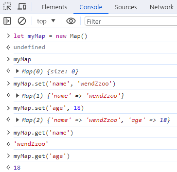

**`Map`中的一个键只能出现一次，它在`Map`的集合中是独一无二的，重复设置的会被覆盖**：

```js
myMap.set('name', 'jack')
```

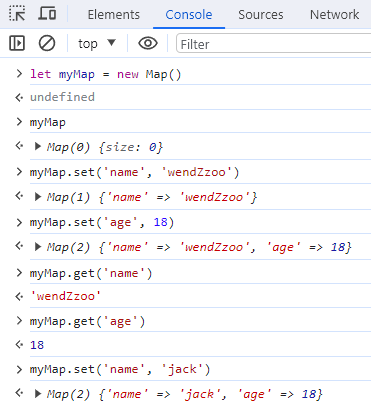

**`Map`的键和值可以是任意类型的数据**：

```js
myMap.set({name: 'wendZzoo'}, [{age: 18}])
```

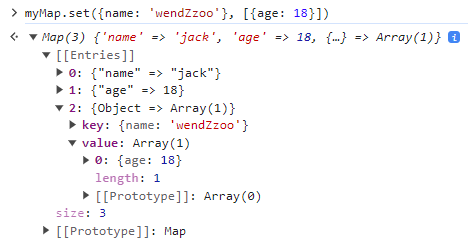

**删除**：

```js
let myMap = new Map()
myMap.set('name', 'Tom')
myMap.delete('name')
```

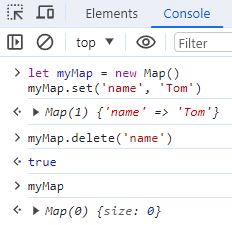

**key数据类型是对象时，需要使用对应的引用来删除键值对**:

```js
let myMap = new Map()
let key = [{name: 'Tom'}]
myMap.set(key, 'Hello')
myMap.delete(key)

// 如果使用不同的引用来尝试删除键值对
// 它将无法正常工作
// 因为Map无法识别这两个引用是相同的键
myMap.set([{name: 'Tom'}], 'Hello')
myMap.delete([{name: 'Tom'}])
```

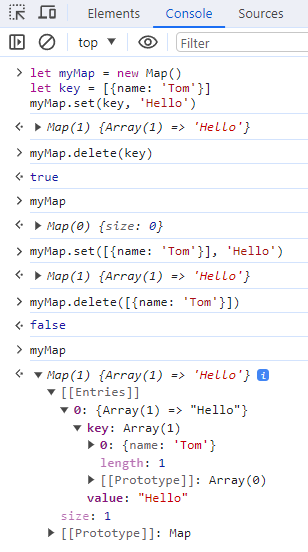

### Set

`Set`是一种集合数据结构，它允许存储唯一的值，无重复项。`Set`对象可以存储任何类型的值，包括基本类型和对象引用。

```js
let mySet = new Set()

mySet.add('wendZzoo')
mySet.add(18)
mySet.add({province: 'jiangsu', city: 'suzhou'})
```

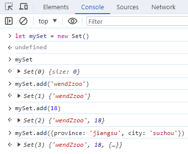

可迭代

```js
for (let key of mySet) {
    console.log(key)
}
```

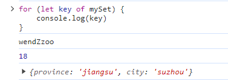

### Proxy

`Proxy`对象用于创建一个对象的代理，从而实现基本操作的拦截和自定义（如属性查找、赋值、枚举、函数调用等）。

Vue 响应式的前提就是需要数据劫持，在 JS 中有两种劫持 `property` 访问的方式：`getter / setters` 和 `Proxies`。Vue 2 使用 `getter / setters` 完全是出于支持旧版本浏览器的限制，而在 Vue 3 中则使用了 `Proxy` 来创建响应式对象。

创建 `Proxy` 对象时，需要提供两个参数：目标对象 `target`（被代理的对象）和一个处理程序对象 `handler`（用于定义拦截行为的方法）。

其中 `handler` 常用的有 `get`，`set` 方法。

`handler.get()` 方法用于拦截对象的读取属性操作，完整使用可以参考：[MDN](https://developer.mozilla.org/zh-CN/docs/Web/JavaScript/Reference/Global_Objects/Proxy/Proxy/get)

它接收三个参数：

1. `target`：目标对象
2. `property`：被获取的属性名
3. `receiver`：`Proxy` 或者继承 `Proxy` 的对象

```js
const obj = {name: 'wendZzoo', age: 18}
let myProxy = new Proxy(obj, {
    get: (target, property, receiver) => {
        console.log('收集依赖')
        return target[property]
    }
})

// 执行 myProxy.name
// 执行 myProxy.age
```

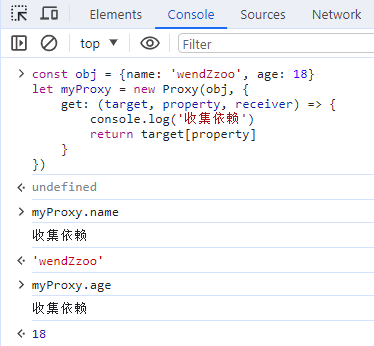

`handler.set()` 方法是设置属性值操作的捕获器，完整使用参考：[MDN](https://developer.mozilla.org/zh-CN/docs/Web/JavaScript/Reference/Global_Objects/Proxy/Proxy/set)

它接收四个参数

1. `target`：目标对象
2. `property`：将被设置的属性名或 `Symbol`
3. `value`：新属性值
4. `receiver`：最初被调用的对象。通常是 `proxy` 本身，但 `handler` 的 `set` 方法也有可能在原型链上，或以其他方式被间接地调用（因此不一定是 `proxy` 本身）

```js
const obj = {name: 'wendZzoo', age: 18}
let myProxy = new Proxy(obj, {
    get: (target, property, receiver) => {
        console.log('收集依赖')
        return target[property]
    },
    set: (target, property, value, receiver) => {
        console.log('触发依赖')
        target[property] = value
        return true
    }
})
myProxy.name = 'Jack'
myProxy.age = 20
```

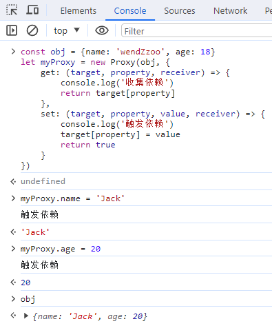

`Proxy` 提供了一种机制，通过拦截和修改目标对象的操作来实现自定义行为，在 `get` 和 `set` 方法打印日志的地方，也就是 Vue3 实现依赖收集和触发依赖的地方。

### Reflect

`Reflect` 是一个内置的对象，它提供拦截 JS 操作的方法。这让它可以完美的和 `Proxy` 配合，`Proxy` 提供了对对象拦截的时机位置，`Reflect` 提供拦截方法。

`Reflect` 不是一个构造函数，因此不能 `new` 进行调用，更像 `Math` 对象，作为一个函数来调用，它所有的属性和方法都是静态的。

常用的方法有 `get`，`set`。

`Reflect.get`方法允许你从一个对象中取属性值，完整使用参考：MDN

它接收三个参数：

1. `target`：需要取值的目标对象
2. `propertyKey`：需要获取的值的键值
3. `receiver`：如果 `target` 对象中指定了`getter`，`receiver` 则为 `getter` 调用时的`this`值

```js
let obj = {name: 'wendZzoo', age: 18}
Reflect.get(obj, 'name')
Reflect.get(obj, 'age')
```

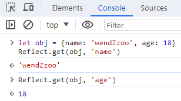

`Reflect.set` 方法允许在对象上设置属性，完整使用参考：MDN

它接收三个参数：

1. `target`：设置属性的目标对象
2. `propertyKey`：设置的属性的名称
3. `value`：设置的值
4. `receiver`：如果遇到 `setter`，`receiver`则为`setter`调用时的`this`值

```js
let obj = {}
Reflect.set(obj, 'name', 'wendZzoo')

let arr = ['name', 'address']
Reflect.set(arr, 1, 'age')
Reflect.set(arr, 'length', 1)
```

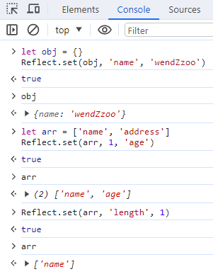

## 更改目录

src 下新建文件夹 reactivity，新建 effect.ts 和 reactive.ts。

tests 文件夹下删除上一篇文章中用于验证 jest 安装的 index.spec.ts，新建effect.spec.ts 和 reactive.spec.ts。

## reactive

先写单测，明确需要的成果，再根据这个需求来实现函数。Vue3 的 `reactive` 方法返回一个对象的响应式代理，那代理的对象和源对象是不同的，但是又能和源对象一样的嵌套结构。

那单测可以这样写：reactive.spec.ts

```ts
import { reactive } from "../reactivity/reactive";

describe("reactive", () => {
  it("happy path", () => {
    let original = { foo: 1 };
    let data = reactive(original);

    expect(data).not.toBe(original);
    expect(data.foo).toBe(1);
  });
});
```

根据这两个断言，来实现现阶段的`reactive`方法。Vue3 中是使用`Proxy`实现。

reactive.ts

```ts
export function reactive(raw) {
  return new Proxy(raw, {
    get: (target, key) => {
      let res = Reflect.get(target, key);
      // TODO 依赖收集
      return res;
    },
    set: (target, key, value) => {
      let res = Reflect.set(target, key, value);
      // TODO 触发依赖
      return res;
    },
  });
}
```

运行`reactive`单测，来验证该方法实现是否正确，执行 `yarn test reactive`

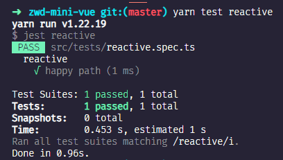

## effect

在官网上是没有单独提到这个 API 的，可以在进阶主题的深入响应式系统一篇中找到它的身影。

`effect`直接翻译为作用，意思是使其发生作用，这个使其的其就是我们传入的函数，所以`effect`的作用就是让我们传入的函数发生作用，也就是执行这个函数。

### 使用示例

```vue
import { reactive, effect } from "vue";

let user = reactive({
  age: 10,
});

let nextAge;

function setAge() {
  effect(() => {
    nextAge = user.age + 1;
  });
  console.log(nextAge);
}

function updateAge() {
  user.age++;
  console.log(nextAge);
}
```

在没有使用`effect`作用于`nextAge`时，直接触发`updateAge`方法，输出的`nextAge`就是`undefined`；

调用`setAge`，`effect`中函数执行给`nextAge`赋值，响应式数据`user`中`age`变化，`nextAge`也在继续执行`effect`中函数。

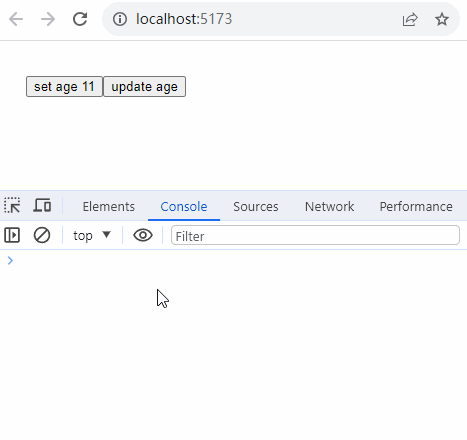

### 单测

那`effect`的单测可以写成这样：

```ts
import { effect } from "../reactivity/effect";
import { reactive } from "../reactivity/reactive";

describe("effect", () => {
  it("happy path", () => {
    let user = reactive({
      age: 10,
    });
    let nextAge;
    effect(() => {
      nextAge = user.age + 1;
    });
    expect(nextAge).toBe(11);
  });
});
```
`effect`方法就是接收一个方法，并执行它。

effect.ts

```ts
class ReactiveEffect {
  private _fn: any;
  constructor(fn) {
    this._fn = fn;
  }
  run() {
    this._fn();
  }
}

export function effect(fn) {
  let _effect = new ReactiveEffect(fn);
  _effect.run();
}
```

通过抽离成一个`Class`类，去执行传入的 `fn` 参数。

再来执行所有的单测，验证是否成功，执行`yarn test`

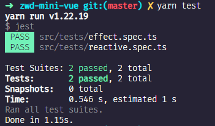

## 依赖收集

修改`effect`单测，增加一个断言，来判断当`age`变化时，`nextAge`是否也更新了？

```ts
import { effect } from "../reactivity/effect";
import { reactive } from "../reactivity/reactive";

describe("effect", () => {
  it("happy path", () => {
    let user = reactive({
      age: 10,
    });
    let nextAge;
    effect(() => {
      nextAge = user.age + 1;
    });
    expect(nextAge).toBe(11);

    // +++updater
    user.age++;
    expect(nextAge).toBe(12);
  });
});
```

执行单测发现无法通过，是因为`Proxy`代理时候并没有实现依赖收集和触发依赖，也就是 reactive.ts 中还有两个 TODO。

但是，首先得清楚什么叫依赖？

引用官方的例子：

```js
let A0 = 1
let A1 = 2
let A2 = A0 + A1

console.log(A2) // 3

A0 = 2
console.log(A2) // 仍然是 3
```

当我们更改 A0 后，A2 不会自动更新。

那么我们如何在 JavaScript 中做到这一点呢？首先，为了能重新运行计算的代码来更新 A2，我们需要将其包装为一个函数：

```js
let A2

function update() {
  A2 = A0 + A1
}
```

然后，我们需要定义几个术语：

* 这个 update() 函数会产生一个副作用，或者就简称为作用 (effect)，因为它会更改程序里的状态。
* A0 和 A1 被视为这个作用的依赖 (dependency)，因为它们的值被用来执行这个作用。因此这次作用也可以说是一个它依赖的订阅者 (subscriber)。

因此我们可以大胆通俗的讲，依赖就是指的是观察者（通常是视图或副作用函数）对数据的依赖关系。当观察者需要访问特定数据时，它就成为该数据的依赖。

那**依赖收集**呢？

依赖收集是用于追踪和管理数据依赖关系。常用于实现响应式系统，其中数据的变化会自动触发相关的更新操作。

当数据发生改变时，相关的视图或操作也能够自动更新，以保持数据和界面的同步。依赖收集可以帮助我们建立起数据和视图之间的关联，确保数据的变化能够自动反映在视图上。

从代码层面讲，读取对象的时候也就是get操作时，进行依赖收集，将目标对象target，对象中key，Dep实例做关联映射。

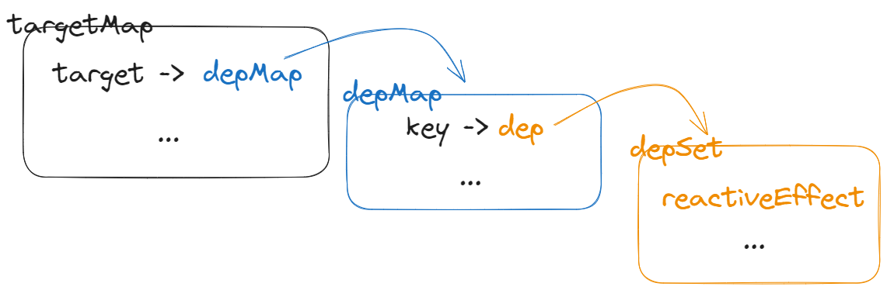

在 effect.ts 中定义依赖收集的方法`track`。

```ts
class ReactiveEffect {
  private _fn: any;
  constructor(fn) {
    this._fn = fn;
  }
  run() {
    reactiveEffect = this;
    this._fn();
  }
}

let targetMap = new Map();
export function track(target, key) {
  // target -> key -> dep
  let depMap = targetMap.get(target);
  if (!depMap) {
    depMap = new Map();
    targetMap.set(target, depMap);
  }
  let dep = depMap.get(key);
  if (!dep) {
    dep = new Set();
    depMap.set(key, dep);
  }
  dep.add(reactiveEffect);
}

let reactiveEffect;
export function effect(fn) {
  let _effect = new ReactiveEffect(fn);
  _effect.run();
}
```

## 触发依赖

在设置对象属性时，也就是进行`set`操作时，触发依赖。将每个属性上挂载的`dep`的`Set`结构中的所有作用函数执行。

```ts
export function trigger(target, key) {
  let depMap = targetMap.get(target);
  let dep = depMap.get(key);
  for (const effect of dep) {
    effect.run();
  }
}
```

至此，再次执行所有单测，`yarn test`

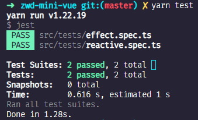

## 总结

1. 先通过单测入手，明确需要实现的函数方法的功能
2. 分布实现功能点，即拆分功能点，先初步实现了`reactive`方法简单版，只要求原数据和代理之后的数据不同，但是数据结构又要一样，像深拷贝一样。
3. 通过`Class`类，实现`effect`方法可以自执行其传入的函数参数
4. 依赖收集，通过两个`Map`结构和一个`Set`结构来映射数据关系，将所有的`fn`存放到`dep`中。通过一个全局变量`reactiveEffect`来获取到`effect`实例，为后续触发依赖时，直接拿`dep`中每一项去执行。
5. 触发依赖，通过映射关系获取到`dep`，因为`dep`是`Set`结构，可迭代，循环每项执行。