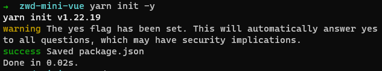
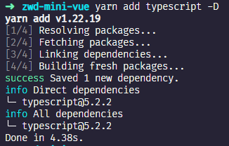
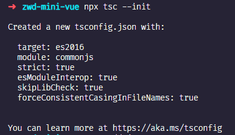
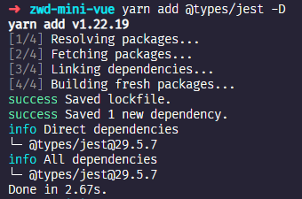
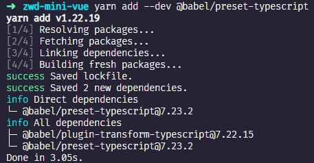
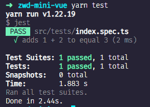

# 1.搭建项目环境，集成ts和jest

## 前言

开新坑。

斥巨资购入大崔哥的 mini-vue 课程，为了改变自己东一榔头西一棒槌的学习状态，也
是因为深刻思考了自己身无长物浑浑噩噩这么多年只会敲代码，别无出路，也只能提升自己继续走技术这条路，那提高技术绕不过去的就是读源码。

试了，读不懂。

直接阅读源码的难度太大，因为除了核心逻辑以外框架本身还要处理很多 edge case(边缘情况) 、错误处理、热更新等一系列工程问题。因此我想通过大崔哥的 mini-vue 视频课程来简化学习 Vue3 源码的难度。

在B站也看过试听课，他会先带着写一个单元测试（目标），然后写代码让单测通过（实现），最后在使用重构手法让代码变的更可读。学完这个岂不是 Vue3源码，单元测试，编程思想，重构手法一把抓了嘛。

因此，我开设一个专栏，从我学习的角度按照课程进度来记录学习成果，如果你也有感兴趣可以查看课程详情：https://nkunu.xet.tech/s/2BQQT6 自行购买学习，知识付费时代，值得就为自己投资。


其实看我专栏也是一样的。

## 创建文件

首先创建文件夹zwd-mini-vue

进入文件夹，执行 `yarn init -y`，创建一个 package.json 文件



创建 src 文件夹，src 下创建 index.ts 文件，创建 tests 测试文件夹，tests 下创建 index.spec.ts 文件，文件目录结果如下：

```shell
|-src
 |-index.ts
 |-tests
    |-index.spec.ts
```

index.ts 代码如下：

```ts
export function sum(a, b) {
  return a + b;
}
```

index.spec.ts 代码如下：

```ts
import { sum } from "../index";

test("adds 1 + 2 to equal 3", () => {
  expect(sum(1, 2)).toBe(3);
});
```

## 安装TS

整个项目都是 `ts` 实现的，按照上文介绍创建的文件，此时应该都是飘红的，因为还没有安装 `ts` 依赖呀。终端中根目录下执行 `yarn add typescript -D`，安装`typescript`



创建 `ts` 配置文件，执行 `npx tsc --init`



`ts` 类型问题不是关键，这里需要支持 `any` 类型，默认是不支持的，所以上文创建的 index.ts 中参数有飘红。 解决 index.ts 中 any 类型报错问题，需要在 ts 配置文件中修改支持 any：

```json
"noImplicitAny": false
```

## 安装测试库Jest

参考官方文档教程 https://www.jestjs.cn/docs/getting-started

安装`jest`，执行 `yarn add --dev jest`

package.json 中添加代码，方便后续测试jest是否安装成功，单测是否可以跑通。

```json
{
  "scripts": {
    "test": "jest"
  }
}
```

默认 `jest` 是 node 端测试工具，支持 commonjs，也就是用 `require` 引入文件。通过 `babel` 让 `jest` 支持 `esm` 格式，执行安装命令

```shell
yarn add --dev babel-jest @babel/core @babel/preset-env
```

根目录下创建 babel.config.js 配置文件，写入：

```js
module.exports = {
  presets: [['@babel/preset-env', {targets: {node: 'current'}}]],
};
```

解决 index.spec.ts 中 `ts` 不识别 `jest` 问题，安装 @types/jest, 执行
`yarn add @types/jest -D`



执行 `yarn add --dev @babel/preset-typescript`



修改 babel.config.js

```js
module.exports = {
  presets: [
    ['@babel/preset-env', {targets: {node: 'current'}}],
    '@babel/preset-typescript',
  ],
};
```

此时，单测文件 index.spec.ts 中就没有飘红报错了。

## 验证

执行 `yarn test`



项目环境搭建完成。