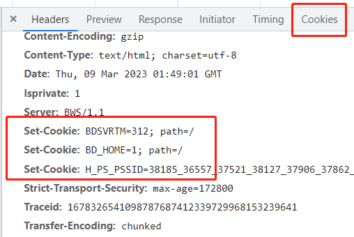

# 鉴权的发展历程

## 背景

标准的Http协议是无状态的，正因为这种无状态的缘故，导致像这样的场景下用户体验就很不好。

例如，一个网站，它有一个首页有一个欢迎页面，当首次访问它的时候先定向到欢迎页面再进入首页，而在一个有效时间内重复访问的话就可以跳过欢迎页面直接进行首页。

但是由于网络通讯是无状态的，这样的需求是无法实现的。

因为只要发起的请求是一样的，服务器是无法知道哪一个用户从哪一个地方进行访问，所得到的响应结果都是一样的。

这就是最早的标准Http协议。

## cookie

相对于正餐是邀请求的文件，cookie只是携带的小零食。

发起网络请求后，服务器返回的响应头RES里携带了cookie，`set-cookie: key=value`，这里附加的是状态信息。

这样夹带私货的是在标准Http协议里规定的，也就是说任何标准浏览器都会支持这样一个功能。

当服务器返回过的响应头里有cookie之后，后续浏览器再次**发送请求时就会携带这个cookie**，返回给服务器，服务器一看这个请求里有我之前设置的cookie，那就能识别出这是重复的请求。
服务器需要更新这个状态时，会在后续的请求中相应的修改cookie。

但这样会有个问题，cookie已经是一种标准协议规定的存在，那所有发送的请求里的cookie都是在控制台中可以直接看到的，这样数据的**安全性无法保证**。

正因为cookie存在这样的风险，一些企业的安全策略会把cookie禁用，这样如果实现的功能是依赖cookie的，这时候就无法生效。

## session

因为cookie这样明文传输，会泄露后台的一些状态的安全性问题，session出现。

session就是一个会话。

将所有的状态信息由服务端来保存，会给这个session状态的上下文设置一个ID，那浏览器端只会保存一个**session ID**，而不是明文的key=value，这样就避免的信息泄露的隐患。

但是session也存在一个问题，如果服务是分布式的，首次请求的服务器是A地的服务器，这个session保存在A，由A生成的session ID 返回给浏览器端。

当下次请求的时候如果A服务器正忙，由B服务器响应，但是B中没有这个session ID对应的上下文数据，它还需要去A中查询，这样就**增加性能开销**。

无论是cookie还是session都是由服务端来主导，前端依靠标准浏览器来实现。

## token

token出现的背景是前端日益发展，前后端分离，数据交互格式使用json。

后端把需要保存的数据**不保存**在服务器，将需要的这些上下文的状态打包成一个token，对这个**token加密**。

token就是个令牌，**所有信息都封装到token里**，服务器端只认token，这个token交给前端，由于这个token是加密的，前端一般无法识别其中内容，这样就解决了cookie这样的明文展示的
安全性问题。

前端在需要的时候把这个token连同请求一起返回给后端，那后端获取到这个token之后就可以对其**解包**，就能获取到其中的信息内容。那对于分布式多地部署的情况，服务器端也不会相互去请求，因为所有需要的信息数据都已经打包到token里，这样也就解决了session这种方案的性能开销的问题。

token不是标准协议规定的一部分，它是由前端后来协商定义的。
