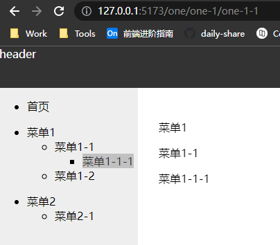

# Vue 权限管理方案

整理总结一下工作中，toB类型的管理平台的必现场景，也是面试中常考点。

## 需求分析

权限管理一般需求是页面权限和按钮权限的管理。

## 实现方案

### 前端方案

较小的项目体量，把所有路由信息放在前端配置

通过路由守卫要求用户登录，登录后通过角色过滤出路由表

比如会配置一个asyncRouters数组，需要认证的页面在其路由的meta中添加一个role字段，等获取到用户角色之后过滤出该用户角色能够访问的路由集合，通过router.addRouters(accessRoutes)方式动态添加路由。

### 服务端方案

一般在admin账号下，会专门有一个所有路由信息的树结构的配置页面，所有的页面路由信息存储在数据库中，用户登录的时候通过角色查询到当前这个角色下能够访问的路由数据，通过接口返回给前端，前端再addRouters动态添加路由信息。

**按钮权限**：

按钮权限的控制通常是实现一个自定义指令，例如v-permission，这个指令其实是一次dom操作，当这个账户角色没有权限时候就删除这个按钮dom，有的话就保留，一般是在指令的mounted钩子函数中进行判断当前用户角色是否存在该按钮权限。

## 优缺点

前端方案

**优点**：

实现简单，不需要额外的权限管理页面

**缺点**：
维护成本高，有新的页面和角色需求时都需要修改前端代码重新打包部署

服务端方案

**优点**：

有专门的角色和权限管理页面，配置页面和权限的信息都存储到数据库中，存储持久化，每次登录时获取到都是最新的路由信息。

## 示例

具体实现一下服务端方案

### 搭建api服务

使用express，安装依赖

```shell
npm install express 
npm install -D @types/express ts-node-dev typescript
```

本地mock数据模拟数据库

路由表：

routes.ts

```ts
export interface IRoute {
 id: number;
 pid: number;
 path: string;
 name: string;
 componentPath: string;
 title: string;
}
export default <IRoute[]>[
 { id: 1, pid: 0, path: "/one", name: "One", title: "菜单1", componentPath: "views/one/index.vue" },
 { id: 2, pid: 0, path: "/two", name: "Two", title: "菜单2", componentPath: "views/two/index.vue" },
 { id: 3, pid: 1, path: "one-1", name: "One1", title: "菜单1-1", componentPath: "views/one/one-1.vue" },
 { id: 4, pid: 1, path: "one-2", name: "One2", title: "菜单1-2", componentPath: "views/one/one-2.vue" },
 { id: 5, pid: 3, path: "one-1-1", name: "One11", title: "菜单1-1-1", componentPath: "views/one/one-1-1.vue" },
 { id: 6, pid: 2, path: "two-1", name: "Two1", title: "菜单2-1", componentPath: "views/two/two-1.vue" },
];
```

用户表，其中auth中对应的是路由id

```ts
export interface IUser {
 id: number;
 name: string;
 auth: number[];
}
export default <IUser[]>[
 { id: 1, name: "zhangsan", auth: [1, 3, 4, 5] },
 { id: 2, name: "lisi", auth: [2, 6] },
 { id: 3, name: "wangwu", auth: [1, 2, 3, 4, 5, 6] },
];
```

app.ts

```ts
import express, { Application, Request, Response } from "express";
import bodyParser from "body-parser";
import { routes, IRoute, users, IUser } from "./data";

const app: Application = express();
const port: number = 8081;

interface IBody {
 uid: number;
}

app.use(bodyParser.urlencoded({ extended: true }));
app.use(bodyParser.json());

app.post("/user_router_list", (request: Request, response: Response) => {
 const { uid }: IBody = request.body;
 if (uid) {
  const userInfo: IUser | undefined = users.filter((user) => user.id == uid)[0];
  if (userInfo) {
   let authRouterInfo: IRoute[] = [];
   userInfo.auth.map((rid) => {
    routes.map((route: IRoute) => {
     if (route.id === rid) {
      authRouterInfo.push(route);
     }
    });
   });
   response.status(200).send({
    msg: "ok",
    data: authRouterInfo,
   });
  } else {
   response.status(200).send({
    msg: "No userInfo for this uid",
    data: null,
   });
  }
 } else {
  response.status(200).send({
   msg: "No uid",
   data: null,
  });
 }
});

app.listen(port, () => {
 console.log(`Example app listening on port ${port}`);
});
```

### 前端项目

vue-cli快速搭建一个demo项目，其中包含vue-router, pinia, axios

路由文件中routes先添加和用户权限无关的页面，首页和404页面

router/index.ts

```ts
import { createRouter, createWebHistory, type RouteRecordRaw } from "vue-router";
import HomeView from "../views/HomeView.vue";

const routes: Array<RouteRecordRaw> = [
 {
  path: "/",
  name: "home",
  component: HomeView,
 },
 {
  path: "/:pathMatch(.*)*",
  name: "NotFound",
  component: () => import("@/views/NotFound.vue"),
 },
];

const router = createRouter({
 history: createWebHistory(import.meta.env.BASE_URL),
 routes,
});

export default router;
```

store中专门有文件处理route数据

stores/route.ts

```ts
import { ref } from "vue";
import { defineStore } from "pinia";
import { getUserRoutes } from "@/api";
import { formatRouteTree } from "@/libs";
import type { IRoute } from "@/typings";

export const useRouteStore = defineStore("route", () => {
 let uid = ref<number>(3);
 let hasAuth = ref<boolean>(false);
 let routeTree = ref<IRoute[]>([]);

 function setAuth() {
  hasAuth.value = true;
 }

 async function setRouteList() {
  const routes = (await getUserRoutes(uid.value)) as unknown as IRoute[];
  routeTree.value = formatRouteTree(routes);
  setAuth();
 }

 return {
  uid,
  hasAuth,
  routeTree,
  setRouteList,
 };
});
```

其中通过getUserRoutes方法调用接口获取当前用户角色下能够访问的路由表，formatRouteTree方法来将接口获取到平级数据转换成树状结构，这里生成的routeTree数组还不是处理成vue-router可以识别的路由结构，只是单纯的用于侧边栏展示的树状菜单

IRoute 接口格式

```ts
export interface IRoute {
 id: number;
 pid: number;
 path: string;
 name: string;
 componentPath?: string;
 title: string;
 children?: IRoute[];
}
```

lib/utils.ts

```ts
import type { IRoute } from "@/typings";

export function formatRouteTree(data: IRoute[]) {
 const parents = data.filter((routerInfo) => routerInfo.pid === 0);
 const children = data.filter((routerInfo) => routerInfo.pid !== 0);

 dataToTree(parents, children);

 function dataToTree(parents: IRoute[], children: IRoute[]) {
  parents.map((parent) => {
   children.map((child, index) => {
    if (child.pid === parent.id) {
     let _children: IRoute[] = JSON.parse(JSON.stringify(children));
     _children.splice(index, 1);
     dataToTree([child], _children);

     if (parent.children) {
      parent.children.push(child);
     } else {
      parent.children = [child];
     }
    }
   });
  });
 }

 return parents;
}
```

这里拿到routeTree数组，就可以通过递归组件生成菜单栏

但此时还没有办法进行路由跳转，因为还没有处理路由添加到router中

router/route.ts

```ts
import type { IRoute } from "@/typings";
import type { RouteRecordRaw, Router } from "vue-router";
const modules = import.meta.glob("@/views/**/*.vue");

export function gengerateRouter(routeTree: IRoute[]) {
 let newRoutes = routeTree.map((route) => {
  let _route: RouteRecordRaw = {
   path: route.path,
   name: route.name,
   component: modules[`/src/${route.componentPath}`],
   children: [],
  };
  if (route.children) {
   _route.children = gengerateRouter(route.children);
  }
  return _route;
 });
 return newRoutes;
}

export function routerBeforeEach(router: Router, routeStore: any) {
 router.beforeEach(async (to, from, next) => {
  if (!routeStore.hasAuth) {
   await routeStore.setRouteList();
   const newRoutes = gengerateRouter(routeStore.routeTree);
   console.log(newRoutes);
   newRoutes.forEach((route) => router.addRoute(route));
   next({ path: to.path });
  } else {
   next();
  }
 });
}
```

routerBeforeEach 方法在main.js中调用

main.ts

```ts
import { useRouteStore } from "@/stores/route";
import { routerBeforeEach } from "@/router/route";
const routeStore = useRouteStore();
routerBeforeEach(router, routeStore);
```

另外，在父级路由页面中需要`<router-view />`进行占位，供子路由展示，例如：

views/one/one-1.vue

```html
<template>
 <div>
  <p>菜单1-1</p>
  <router-view />
 </div>
</template>
```

效果


