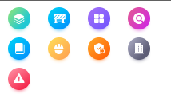
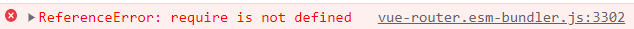

# vue3本地静态资源循环引用路径问题

v-for 循环引用本地静态资源，vue3和vue2的使用方式不同

## vue2 使用require

```js
<template>
 <div id="app">
  <div v-for="(img, i) in imgs" :key="img.id" >
   
  </div>
 </div>
</template>

<script>
export default {
 name: "App",
 data() {
  return {
   imgs: [
    { id: 1, src: require("./assets/menu1.png") },
    { id: 2, src: require("./assets/menu2.png") },
    { id: 3, src: require("./assets/menu3.png") },
    { id: 4, src: require("./assets/menu4.png") },
    { id: 5, src: require("./assets/menu5.png") },
    { id: 6, src: require("./assets/menu6.png") },
    { id: 7, src: require("./assets/menu7.png") },
    { id: 8, src: require("./assets/menu8.png") },
    { id: 9, src: require("./assets/menu9.png") },
   ],
  };
 },
};
</script>

```

输出结果



## vue3

vue3中使用require有如下报错



require 是 cjs 里的语法，vue2 普遍用 webpack 打包，兼容了 cjs 语法。

### 使用 new URL

vite 官方推荐使用方式： [官网地址](https://cn.vitejs.dev/guide/assets.html#new-url-url-import-meta-url)

```js
<script setup>
function requireImg(i) {
 return new URL(`./assets/menu${i + 1}.png`, import.meta.url).href;
}
</script>

<template>
 <div v-for="(img, i) in 9" :key="i">
  
 </div>
</template>
```

尤其需要注意，**new URL 传入的地址必须要是个字符串**

```js
// imagePath是个传入的变量， Vite 不会转换这个
const imgUrl = new URL(imagePath, import.meta.url).href
```

### vite插件

如果想要按照vue2中写法实现

安装插件

```shell
 pnpm add -D vite-plugin-require-transform
```

在vite.config中配置

```js
import { defineConfig } from "vite";
import requireTransform from "vite-plugin-require-transform";

export default defineConfig({
 plugins: [
  requireTransform({
   fileRegex: /.js$|.vue$/,
  }),
 ],
});
```

输出结果一致
