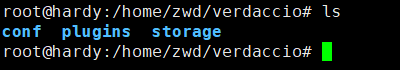

# Verdaccio搭建npm私服

## 为何要搭建npm私服

搭建npm私服好处多多，网上随便一篇教程搜出来都罗列了诸多好处，譬如:

1. 公司内部开发环境与外网隔离，内部开发的一些库高度隐私不便外传，内网搭建npm服务保证私密性
2. 同属内网，可以确保使用npm下载依赖快速稳定
3. 控制npm模块质量和安全，对于下载、发布npm包有对应的权限管理
4. 接触前端运维，拒绝当个纯页面仔，简历好装逼
5. ...

## 方案选择

时至今日，较好的免费选择有 Nexus, Verdaccio。

本篇介绍 Verdaccio 搭建的完整流程和诸多踩坑细节，Nexus有机会再分享。

## 上手Verdaccio

这里默认你已经掌握了 linux, docker 的基本使用，也默认你有一个linux服务器已经安装好了docker。

以下都是在 Ubuntu 18.04.4 系统中实操

### 直接用docker启动 verdaccio

指令：`docker run -it -d --name zwd_verdaccio -p 4873:4873 verdaccio/verdaccio`

不是还没有安装 verdaccio 镜像呢么，不用慌，如上指令会先直接下载 verdaccio/verdaccio镜像

稍微解释一下指令的含义：

1. docker run 启动容器
2. --name zwd_verdaccio 这个容器名叫 zwd_verdaccio

### 查看当前正在运行的docker容器

指令docker ps ，加个 -a就能看到所有的

### 复制这个容器内的配置文件到宿主机上，这样方便修改

我看了很多很多很多的教程，都是让挨个新建文件的，当时真迷糊为啥要建这么文件，现在真迷糊为啥要这么麻烦

指令 `docker cp zwd_verdaccio:/verdaccio /home/zwd/verdaccio` 轻松一句直接在本地生成了配置文件。

这个指令的意思就是把上面刚刚开启的 zwd_verdaccio里的配置文件复制到 /home/zwd/verdaccio这个路径下，也可以自定义路径。

这里 linux 的文件路径和 windows 下有很大区别。

查看 /home/zwd/verdaccio



### 设置 verdaccio 权限

很重要的一点，指令chown -R 10001:65533 /home/zwd/docker/verdaccio 不然后期出现权限的问题

### 删除 zwd_verdaccio 容器

配置文件复制完成，这个容器的作用也就结束了，指令docker rm -f zwd_verdaccio

### 修改以下本地的配置文件

可以参考官方文档给的一个示例，够用 <https://verdaccio.org/docs/configuration/>

```text
storage: ./storage
web:
  title: Verdaccio
auth:
  htpasswd:
    file: ./htpasswd
    max_users: 1000
    algorithm: md5
uplinks:
  npmjs:
    url: <https://registry.npmjs.org/>
  yarn:
    url: <https://registry.yarnpkg.com/>
packages:
  '@*/*':
    access: $all
    publish: $authenticated
    unpublish: $authenticated
    proxy: npmjs
  '**':
    access: $all
    publish: $authenticated
    unpublish: $authenticated
    proxy: npmjs
server:
  keepAliveTimeout: 60
listen: 0.0.0.0:4873
middlewares:
  audit:
    enabled: true
logs: { type: stdout, format: pretty, level: http }
```

### 启动一个挂载目录的verdaccio镜像

指令 `docker run -it -d --name zwd_verdaccio -v /home/zwd/verdaccio/conf:/verdaccio/conf -p 4873:4873 verdaccio/verdaccio`

-v 后面那句表示用本地刚刚新建的配置文件代替原本容器内配置文件。

这时在浏览器端输入你的服务器IP + 4873端口，即可看见Verdaccio界面，例如我的就是 <http://106.53.143.75:4873/>

需要注意的前提是，你需要给你的服务器防火墙和安全规则放开4873端口

### 文件的目录的小改动

这时候回到/home/zwd/verdaccio/conf下会发现 新建了 storage 和 htpasswd，这是因为基于新的配置文件，那之前复制的文件目录里 plugins 和 storage 就无效了可删除。

这里还有个坑，需要给添加权限，指令`chown -R 10001:65533 /home/zwd/docker/verdaccio/conf/htpasswd`, 否则在 npm adduser 时会提示 500Error

如遇到提示报错，可通过指令`docker logs --tail 20 zwd_verdaccio`查看具体报错进行问题定位。

如上就可以搭建出一个npm私服。
