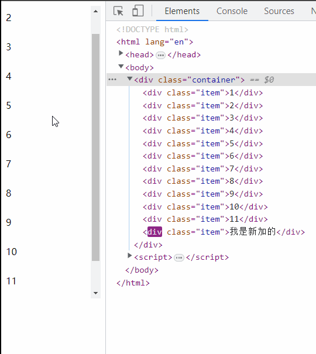
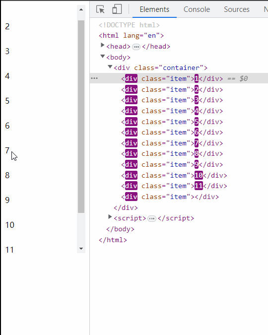

# 虚拟滚动列表组件

## 为什么需要开发这样一个组件

1. 可视化大屏需要这样的列表展示组件
2. 虚拟滚动的需求是逐渐演变的，初期只需要列表展示的组件，一次性展示所有数据，数据量大的时候导致页面渲染卡顿

## 解决方案

1. 分页加载，每页控制展示条目，性能可控，但是大屏展示一般不需要操作，分页的方案不可取
2. 无限滚动，初始加载一小部分，越滚动加载越多，性能问题是迟早的事
3. 虚拟滚动

## 懒加载，无限滚动

**优点**：实现相对简单，不需要额外引入类库。不用考虑每一个 item 的高度有多少。

**缺点**：

1. 频繁下拉导致数据量越来越多，滚动条越来越短
2. 已经加载过的滚动隐藏区域数据没有做渲染上处理
3. 页面切换回来之后列表的滚动状态丢失，需要重新滚动

**具体实现**:

首先两个概念：

1. Element.scrollHeight 这个只读属性是一个元素内容高度的度量，包括由于溢出导致的视图中不可见内容。
2. Element.scrollTop 属性可以获取或设置一个元素的内容垂直滚动的像素数。
scrollHeight 内容区域的全部高度（包含隐藏起来的）- scrollTop 已经卷起来的高度 = 剩余的内容高度（可视区域高度 + 还没卷起来的高度）
判断这个剩余的内容高度 和 设定的外层容器（可视区域）的高度，如果小的，说明滚动内容结束了，就需要展示新增的数据。

````html
<style>
  .container {
    width: 100%;
    height: 500px;
    overflow: auto;
  }
  .item {
    height: 50px;
  }
</style>

<div class="container">
<div class="item">1</div>
<div class="item">2</div>
<div class="item">3</div>
<div class="item">4</div>
<div class="item">5</div>
<div class="item">6</div>
<div class="item">7</div>
<div class="item">8</div>
<div class="item">9</div>
<div class="item">10</div>
<div class="item">11</div>
</div>

<script>
  const container = document.querySelector(".container");
  container.addEventListener("scroll", () => {
    const offset = container.scrollHeight - container.scrollTop;
    const delta = 50;

    if (offset <= 500 + delta) {
      const newItemDom = document.createElement("div");
      newItemDom.setAttribute("class", "item");
      newItemDom.innerHTML = "我是新加的";
      container.appendChild(newItemDom);
    }
  });
</script>
````



## IntersectionObserver + 空div占位

````js
container.addEventListener("scroll", () => {
 // 如上...
  observer();
});

function observer() {
  const items = Array.from(container.children) || [];
  console.log(items.length);
  items.forEach((item) => {
    const intersectionObserver = new IntersectionObserver(
      function (entries) {
        if (!entries[0].isVisible) {
          entries[0].target.backup = entries[0].target.innerHTML || entries[0].target.backup;
          entries[0].target.innerHTML = "";
          return;
        }
        entries[0].target.innerHTML = entries[0].target.backup || entries[0].target.innerHTML;
      },
      {
        threshold: [0, 1],
        trackVisibility: true,
        delay: 100,
      }
    );
    intersectionObserver.observe(item);
  });
````



## 虚拟列表

虚拟列表就是按需显示的一种显示，只对可视区域进行渲染，对非可见区域的数据不渲染或部分渲染的技术，从而提升性能
屏幕的可视区域高度200px ， 列表项目的高度20px, 在屏幕中只能看到10个列表项，在首次渲染时候只需要加载10条数据
实现
动态计算获得可视区域的列表项，将不可视区域内存在的列表项删除

1. 当前可视区域起始数据索引 startIndex
2. 计算当前可视区域结束数据索引 endIndex
3. 计算当前可视区域的数据，渲染到页面上
4. 计算 startIndex对应的数据在整个列表中的偏移位置 startOffset并设置到列表上

````html
<style>
  .container {
    height: 500px;
    overflow: auto;
  }
  .item {
    height: 40px;
  }
</style>
<div class="container"></div>
<script>
const data = [
  1, 2, 3, 4, 5, 6, 7, 8, 9, 10, 11, 12, 13, 14, 15, 16, 17, 18, 19, 20, 21, 22, 23, 24, 25, 26, 27, 28, 29, 30,
];
const container = document.querySelector(".container");

window.onload = function () {
  addList(data, container);
};

function addList(data, container) {
  data.forEach((item) => {
    const dom = document.createElement("div");
    dom.setAttribute("class", "item");
    dom.innerHTML = item;
    container.appendChild(dom);
  });
}

container.addEventListener("scroll", () => {
  const scrollTop = container.scrollTop;

  // 上边空白的高度
  const topHeight = scrollTop;
  const startIndex = Math.max(Math.ceil(topHeight / 40) - 2, 0);
  const endIndex = startIndex + Math.ceil(500 / 40);

  const show = data.slice(startIndex, endIndex + 1);

  // 计算下边剩余的隐藏区域高度
  const dataHeight = data.length * 40;
  const bottomHeight = dataHeight - 500 - scrollTop;

  const topDom = document.createElement("div");
  const bottomDom = document.createElement("div");
  topDom.style.height = topHeight + "px";
  bottomDom.style.height = bottomHeight + "px";

  // 还没到底
  if (bottomHeight > -100) {
    // 清空
    container.innerHTML = "";
    container.appendChild(topDom);
    addList(show, container);
    container.appendChild(bottomDom);
  }
});
</script>
````

### 在vue3中实现

````html
<template>
 <div ref="container" class="box-border w-full h-full overflow-y-auto" @scroll="handleScroll">
  <div ref="panel" :style="{ paddingTop: `${paddingTop}px` }">
   <div
    class="h-10 leading-10 text-[14px] text-[#979797] hover:text-[#59c7f9] hover:cursor-pointer flex"
    v-for="item in visibleList"
    :key="item.id"
   >
    <slot :row="item"></slot>
   </div>
  </div>
 </div>
</template>

<script setup lang="ts">
import type { PropType } from 'vue';
import type { ILiveTimeCompModel } from '@/types/menus';

const props = defineProps({
 list: { type: Array as PropType<ILiveTimeCompModel[]>, default: () => [] }, // original list
 showNum: { type: Number, default: 10 } // render items num
});
const { list, showNum } = toRefs(props);

const container = ref<HTMLElement>();
const panel = ref<HTMLElement>();

const itemHeight = 40;

let count = ref(showNum.value);
let startIdx = ref(0);
let endIdx = ref(showNum.value);

function initVisibleData() {
 const containerHeight = container.value?.getBoundingClientRect().height || 300;
 count.value = Math.ceil(containerHeight / itemHeight);
 endIdx.value = Math.ceil(containerHeight / itemHeight);
}
onMounted(() => initVisibleData());

let visibleList = computed(() => list.value.slice(startIdx.value, endIdx.value));

let paddingTop = ref(0);
let panelHeight = ref(list.value.length * itemHeight);

function getPanelHeight() {
 if (panel.value) panel.value.style.height = `${panelHeight.value}px`;
}

watch(
 () => props.list,
 (list) => {
  panelHeight.value = list.length * itemHeight;
  getPanelHeight();
 },
 { deep: true }
);

onMounted(() => getPanelHeight());

function handleScroll(e: any) {
 startIdx.value = Math.floor(e.target.scrollTop / itemHeight);
 endIdx.value = startIdx.value + count.value;
 paddingTop.value = startIdx.value * itemHeight;
}
</script>
````

### 使用案例

在 [virtual designer](https://github.com/Zuowendong/visual-designer) 项目中实际使用

代码地址：<https://github.com/Zuowendong/visual-designer/blob/master/packages/designer/src/components/VirtualList.vue>
